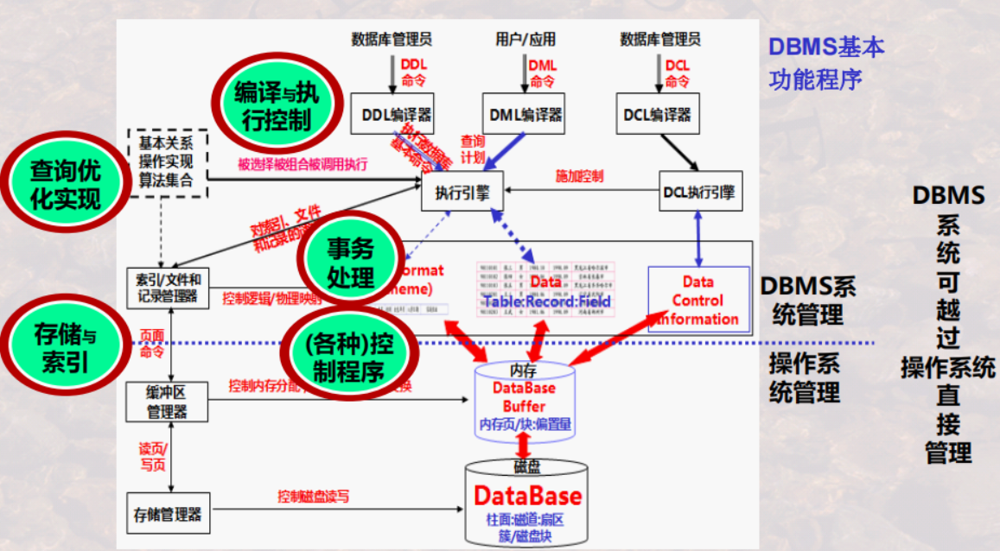

# 数据库系统发展历史 DBS
1. 
|            数据库阶段            |                  成果                  |
| :------------------------: | :------------------------------------: |
|   数据库**技术探索**阶段   |          **DataBase**正式提出          |
|   数据库**技术确立**阶段   |    “**层次/网状/关系模型**”正式提出    |
|   数据库**技术成熟**阶段   | “**标准化数据库系统结构模型**正式提出” |
| 数据库**技术深化发展**阶段 |   **新型/专用/...数据模型**不断涌现    |
2. 
|数据库技术发展阶段|
|:----:|
|人工管理|
|文件系统|
|数据库系统|
1. 
|                    重要发展                     |
| :---------------------------------------------: |
|               **OS** ---> **DBS**               |
|   **层次/网状模型**数据库 ---> **关系**数据库   |
| **关系**数据库 ---> **对象关系/面向对象**数据库 |
|                                                 |
# 数据库 DB
1. 定义：**长期**存储在计算机内的， **有组织**,**可共享**的 **数据集合**
2. 地位
   |                          |
   | :----------------------- |
   | 电子化信息的集合         |
   | 起源于规范化**表**的处理 |

3. **特点**：
   - **结构化**：
      - 主要特征之一
      - DBS与FS の **本质区别**
   - **共享性** ： 
      - 多种“应用/语言/用户”相互覆盖的使用数据集合
   - **冗余度小** ：
      - **减少了**数据冗余
      - 数据**易扩充**
   - **独立性**高:不会因为系统数据**存储结构**与数据**逻辑结构**的变化而影响**应用程序**
   - **统一性**：统一管理+控制，避免数据不一致
      - 安全性保护
      - 完整性检查
      - 并发控制
      - 数据库恢复

### 表 *Table*
 定义 ： 以按行按列形式组织及展现的数据
 奠基者：*E.F.Codd*：
 |            成就            |
 | :------------------------: |
 | 提出**关系模型**+**关系**  |
 |  提出 **关系数据库理论**   |
 |    开创 **数据库时代**     |
 | **数据库管理系统**的奠基者 |
 |  获得计算机领域的“图灵奖”  |

基本术语：
  1. 表名
  2. 列 = 字段 = 属性 = 数据项
  3. 行 = 元组 =记录
  4. 第一行 = 关系的**第一范式**（Σ所有属性）
  5. 表 = 关系
  6. 格式 = 表标题
  7. 值 = 表内容
  8. 标题 = 属性**名称**+ 对属性值的**约束**

作用： 描述了一批相互**有关联关系**的数据

# 数据库系统 DBS
1. DBS的组成(组成)：
   |                    |                              |
   | :----------------: | :--------------------------: |
   |     数据库 DB      |          *DataBase*          |
   | 数据库管理系统 DBMS | *Database Management System* |
   |  数据库应用 DBAP   |    *Database Application*    |
   |  数据库管理员 DBA  |   *Database Administrator*   |

$$
DBS = \sum(DB + DBMS + DBAP + DBA)
$$

1. **功能**：
   - **独立性**：数据的物理独立性+逻辑独立性 ， 较强的独立于应用程序
   - **统一性**：DBMS统一“存取/维护/组织”数据形式+语义
   - **共享性**:将“数据+数据结构的定义+描述”从“应用程序”中抽离---->多个应用程序可共享“数据+数据结构的操作”
  
   **优势**：
   - **高效率** ： 独立于应用程序，查询/统计等操作效率高
   - **易扩充** ： 整体数据**结构化**，文件/记录之间相互有关联，数据冗余度小，易扩充
   - **高共享** ： 统一的数据控制
   - **自主性** ： 系统课自动检查“安全性”，“完整性”，“并发正确性”
# 数据库管理系统（用户角度） DBMS
地位：数据库系统的**核心** , 位于 **用户** 和 **OS** 之间的一层管理软件
1. **数据库定义**：定义数据库Table的名称，标题等 （主要功能）

|        |                                                            |
| :----- | :--------------------------------------------------------: |
| Step 1 |              DBMS提供一套 **数据定义语言DDL**              |
| Step 2 |              用户使用DDL描述其所建立表的格式               |
| Step 3 | DBMS<u>依据用户</u>的**定义描述**，创建数据库及其中的Table |

2.  **数据库操作** ：向数据库中的Table“增加/删除/更改”数据+对数据进行“查询/检索/统计/....”操作

|        |                                                     |
| :----- | :-------------------------------------------------: |
| Step 1 |          DBMS提供一套 **数据操作语言DML**           |
| Step 2 |      用户使用DML描述其所进行的“增删改查”等操作      |
| Step 3 | DBMS<u>依照用户</u>的**操作描述**，实际执行这些操作 |
3. **数据库控制**：控制数据库中数据的使用----数据的 **使用权**

|        |                                                 |
| :----- | :---------------------------------------------: |
| Step 1 |        DBMS提供一套 **数据控制语言DCL**         |
| Step 2 |        用户使用DCL描述对DB所要实施的控制        |
| Step 3 | DBMS<u>依照用户</u>的**控制描述**，实际执行控制 |

4. **数据库维护**：转储/恢复/重组/性能检测/分析....
   
|        |                                             |
| :----- |:---------------------------------------------------: |
| Step 1 |      DBMS提供一系列**程序（实用程序/例行程序）**      |
| Step 2 |          程序中提供了对数据库维护的各种功能           |
| Step 3 | <u>用户使用</u>这些程序，**自行**对各个DB进行维护操作 |

！**实用程序**：一般由DBA来使用和掌握

1. **数据存取**：
   以 “**记录**”/“**数据项**”/“**记录集合**”为单位
## 数据库语言 *DataBase Language*
使用者 通过DBL ---> 利用DBMS ----> 操作DB
|                      |                |     |
| :------------------: | :------------------------------: | :----------------------------------------------: |
|      SQL语言：       |                                  |             均 由DBMS提供+用户对数据             |
| **数据定义语言 DDL** |  *Database Definition Language*  |                 用户定义数据格式                 |
| **数据操作语言 DML** | *Database Manipulation Language* |                用户对数据进行操作                |
| **数据控制语言 DCL** |   *Database Control Language*    |                用户对数据进行控制                |
|      非结构化：      |                                  |                                                  |
|  数据库中的各种操作  |                                  | DBMS根据用户要求 对数据进行“定义/操作/控制/维护” |

## 高级语言 
区别： 一条"DBL" = 高级语言的 "一个/多个 **循环程序**"
|                      |                                         |
| :------------------: | :-------------------------------------: |
| **交互式**数据库语言 |              标准的SQL语言              |
| **嵌入式**数据库语言 | （宿主型）SQL语言嵌入到某一种高级语言中 |
| **双重型**数据库语言 |               交互 + 嵌入               |

# 数据库管理系统（系统角度）
1. DBMS 与 OS（操作系统）：DBMS是在OS支持下的**系统软件**
   
！DBMS可以越过OS**直接管理**
2. 数据库管理系统在完成DB管理之后，后台还运行这一系列的程序
   
|            后台程序            |                                                  |
| :--------------------------------------------------------------: | :----------------------------------------------: |
|                          **语言编译器**                          | 将数据库语言翻译成 **DBMS可以执行的<u>命令</u>** |
| **查询优化**（执行引擎）与**查询实现**（基本命令的不同执行算法） |               提高 数据库检索速度                |
|                        **数据存取与索引**                        |    提供数据在 **磁盘/磁带..**上的高校存取手段    |
|                           **通信控制**                           | 提供<u>网络环境下</u>数据库操作与数据传输的手段  |
|                                                                  |                                                  |
|                           **事务管理**                           |                                                  |
|                           **故障恢复**                           |                                                  |
|                          **安全性控制**                          |                                                  |
|                          **完整性控制**                          |                                                  |
|                         **数据字典管理**                         |                                                  |
|                      **应用程序接口** *API*                      |                                                  |
|                           **实用程序**                           |               数据库数据装在/重组                |
|                          **DB性能分析**                          |                                                  |

# DBS的标准结构
| **数据层次** |                                     |                                             |
| :----------: | :---------------------------------: | :-----------------------------------------: |
|   用户层次   |   *External Level* / *User Level*   | 用户能“看到+处理”的数据，全局数据中的一部分 |
|   逻辑层次   | *Conceptual Level* / *Logic Level*  | 从全局角度“理解/管理”的数据+相关“关联约束”  |
|   物理层次   | *Internal Level* / *Physical Level* |             存储于介质上的数据              |

## **数据结构**
**模式** ：*Schema*
   - 一种结构性描述
   - 所观察到的数据结构信息

**视图** ： *View*
   - <u>某种表现形式下</u>表现出来的数据库中的**数据**

| **三级模式** |              （三级视图）               |                                                                                                 |
| :--------------------------------------------: | :-------------------------------------: | :---------------------------------------------------------------------------------------------: |
|                   **外模式**                   |   *External Schema* /*External View*    |                            用户所能看到+处理的数据的<u>结构描述</u>                             |
|                    **(概念)模式**                    | *Conceptual Schema* / *Conceptual View* | 全局角度理解/管理的数据<u>结构描述</u>+相应的<u>管理约束</u>，体现数据之间的<u>内在本质联系</u> |
|                   **内模式**                   |   *Internal Schema* / *Internal View*   |                               存储在介质上的数据的<u>结构描述</u>                               |

| **两级映像** |               |                     |                                              |                           |
| :--------------------------------------------: | :-----------: | :-----------------: | :------------------------------------------: | :-----------------------: |
|              **外模式-模式映像**               | *E-C Mapping* | 外模式————>概念模式 | 实现 <u>概念试图</u>————><u>外部视图</u>转换 |    便于用户“观察+使用”    |
|              **模式-内模式映像**               | *C-I Mapping* | 概念模式————>内模式 | 实现 <u>概念试图</u>————><u>内部视图</u>转换 | 便于计算机进行“存储+处理” |

**映像作用**：保持数据的**独立性**

| **两个独立性** | |  |
| :----------------------------------------------: |:----: |:-----: |
|**逻辑数据独立性**  |*E-C Mapping*| 当“Conceptual Schema”变化时 ， 只需改变"应用程序"，无需改变“External Schema”                |
|||用户的**应用程序**与数据库中**数据的逻辑结构**相互独立|
|                **物理数据独立性** |*C-I Mapping*| 当“Internal Schema”变化时 ，只需改变"应用程序 "，无需改变“Conceptual Schema”，也无需改变“External Schema” |
|||用户的**应用程序**与**存储在磁盘上**数据库中的数据是相互独立的|

# 数据模型
1. **定义**：规定模式<u>统一描述</u>的模型
2. **特点**：
   - 现实世界 ——> 机器世界 の一个 **中间层次**
   - 现实世界 ——> 信息世界 の **第一层抽象**
   - 用于 **信息世界**の建模
3. **组成**：
    - **数据结构** ：对数据系统的**静态特性**的描述
    - **数据操作** ：对数据系统的**动态特性**的描述
    - **完整性约束**
4. **模型 & 模式**：
   
   数据模型 = 对模式本身结构的抽象
   
   模式     = 对数据本身结构形式的抽象

| 经典数据模型 ||
| :-------------------: | :----------------------: |
|   关系模型                    | **Table**的形式 组织数据 |
|  层次模型                    | **Tree**的形式 组织数据  |
|网状模型                    | **Graph**的形式 组织数据 |
划分依据：**数据之间的联系**
3. 层次模型 & 网状模型 **缺点**：
      - **结构复杂** ：数据关联关系由**指针** 来维系
      - **指针依赖** ：数据检索操作依赖 **指针系统**指示路径
      - **操作繁琐** ：不支持 **记录集合**的操作，需逐一记录的操作

# 数据库种类
**关系数据库**：

   - **结构简单** ：数据关联由**Table**中属性的值来表征，按行列形式组织数据
   - **操作方便** ：数据检索操作不依赖于路径信息/过程信息，支持 **非过程化**的数据操作
   - **数据简洁** ： 支持 “记录集合” 的操作
   - **理论支撑** ： 有较为完善的理论基础

**对象-关系数据库**

   - **数据项分解** ：以对象来封装需要分解的数据项
   - **对象概念** ： 行对象 & 列对象，聚集对象 & 结构对象

**数据项**：不可再分
**面向对象数据库**

   - **技术结合** ：**面向对象O-O**技术 + **聚集操作SQL**技术
   - **技术升级** ： 支持复杂的数据类型，数据封装，抽象数据结构
   - **面向对象** ：支持面向对象一些特性----继承，封装，类，多态...

**XML数据库**
  
   - **半结构化** ：“半结构化”数据库，数据库的另一种形式
   - **统一性** ：“数据”与“数据语义”合并处理+存储
   - **广泛性** ： 面向 **数据交换**而提出，在互联网世界得到广泛应用
  
**其他/新型数据库**：

   - Oracle
   - DB2 
   - MA Access
   - ...

