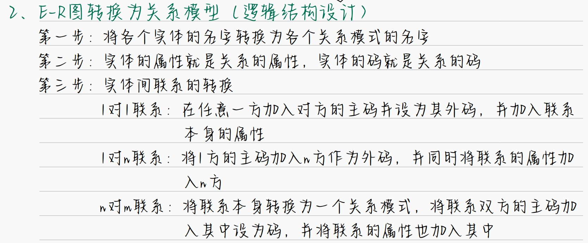

# **基本概念**
### **数据库设计**
- **定义**：
对于一个 给定の应用环境，构造/设计 优化の数据库 **逻辑模式**+**物理结构**，饼据此建立 数据库及其应用系统$\longrightarrow$ 使之能够有效地 **存储**+**管理**数据，满足各种用户の **应用需求**
- **应用要求**：
   - **信息管理要求**$$在DB中应该 存储+管理 ~哪些数据对象？$$
   - **数据操作要求**$$对数据对象需要进行~哪些操作？$$
- **目标**：
为 **用户**/各种**应用系统**提供一个 **信息基础设施**+高效の**运行环境**$$\begin{align*}&高效の运行环境：\\&\qquad\qquad DB~数据~存取效率\\&\qquad\qquad DB~存储空间~利用率\\&\qquad\qquad DB~系统运行~管理效率\\\end{align*}$$
- **特点**：
   - **三分技术**，**七分管理**，**十二分基础数据**：$$十二分基础数据：\qquad\qquad\qquad\qquad\qquad\qquad\qquad\qquad\qquad\\数据の 收集/整理/组织/不断更新 \longrightarrow 数据库建设中の重要环节$$
   - 整个设计过程中：**数据库结构设计**+**数据の处理设计**密切结合
- **设计方法**：
   - **基于E-R模型**の设计方法
   - **新奥尔良**方法 *New Orleans*
   - **3NF**の设计方法
   - **面向对象**の数据库设计方法
   - **统一建模语言**方法*UML*
- **步骤**：（六个阶段反复）
   - **需求分析**阶段
      - 设计过程の**基础**
      - 最困难
      - 最耗时
   - **概念结构**设计阶段
      - 设计の**关键**
   - **逻辑结构**设计阶段
      - 数据模型
   - **物理结构**设计阶段
      - 存储安排
      - 存储方法选择
      - 存储路径建立
   - **数据库实施**阶段
      - 创建DB模式
      - 装入数据
      - DB **试运行**
   - **数据库运行与维护**阶段
      - 性能监测
      - 转储/恢复
      - 数据库重组+重构

### **数据字典**
- **定义**：（六个阶段反复）
- **组成**：（六个阶段反复）
   - **数据项**
      - 不可再分の **数据单位**
   - **数据结构**
      - 反映数据之间の **组合关系**
   - **数据流**
      - **数据结构**在系统内 **传输**の **路径**
   - **数据存储**
      - **数据结构** **停留**/**保存**の地方
      - **数据流**の **来源**/**去向** 之一
   - **处理过程**
      - 具体处理逻辑通过 **判定表**/**判定树**描述

# **需求分析**
- **任务**：$$\begin{align*}通过~&详细调查现实世界要处理の对象\\&充分了解原系统の工作概况\\&明确用户の各种需求\\&考虑系统扩充与改变\\\end{align*}~\Longrightarrow~确定新系统の功能$$
- **用户需求**：
   - **信息需求**$$用户要获得の~信息内容与性质$$
   - **处理需求**$$用户要完成の~数据处理功能$$
   - **安全性与完整性需求**
- **特点**：
   - 重要+困难の任务：**收集**将来应用所涉及的 **数据**
   - 强调 **用户参与**
# **概念结构**设计
- **定义**：
将 需求分析得到の **用户需求**  $~~\underset{\Longrightarrow }{转换}~~~~$ **信息结构**（概念模型）
- **特点**：
   - **真实** : 真实+充分の反映 **现实世界**
   - **易于理解** ：用户の积极参与
   - **易于更改** ：容易对 概念模型进行 **修改**/**扩充**
   - **易于转换** ：向 关系/网状/层次...各种数据模型进行转换
- **设计方法**：
   - **E-R 模型**
      - **定义**：$$使用~E-R图来描述~现实世界の概念模型\\\Downarrow\\实体~，属性~，实体之间~の联系$$
      - **实体关系**：
         - **一对一**联系(1:1)
         - **一对多**联系(1:n)
         - **多对多**联系(m:n)
      - **构成**：
         - **矩形**：实体
         - **椭圆形**：属性
         - **菱形**：联系
         - **无向边**：联系の**类型**
      - E-R图の**集成**：$$Step~1:~合并，解决冲突：\qquad\qquad\qquad\qquad\qquad\qquad\qquad\qquad\qquad$$
         - **属性冲突**$$\begin{align*}&属性域冲突\\&属性取值单位冲突\end{align*}$$
         - **命名冲突**$$\begin{align*}&同名异义\\&异名同义\end{align*}$$
         - **结构冲突**$$\begin{align*}&同一对象\Longrightarrow~不同应用中~不同抽象\\&同一实体\Longrightarrow~不同子系统のE-R图中の属性个数/属性排列次序不完全相同\\&同一联系类型\Longrightarrow~不同のE-R图中不同类型\end{align*}$$ 
         - ---  $$Step~2:消除不必要の冗余\qquad\qquad\qquad\qquad\qquad\qquad\qquad\qquad\qquad$$

# **逻辑结构**设计
- **特点**：
   - 设计结果 **不唯一**
- **目标**：
$$概念结构设计阶段设计好の~"基本E-R图"~~\underset{\Longrightarrow}{转换}~~ 所选用DBS产品所支持の~"数据类型相符合の~逻辑结构~"$$
- **E-R图 $\Longrightarrow 关系数据模型$**：$$一个~实体型+实体之间的关系\Longrightarrow 一个关系模型$$

- **数据模型优化**：
   - Step 1: 确定 **数据依赖**
   - Step 2:将 **各个关系模型**之间の **数据依赖** 进行**极小化处理**
   - Step 3:根据 **数据依赖理论** $\longrightarrow$ 逐一分析**关系模型**$$\begin{align*}&是否存在：\\&\qquad\qquad部分函数依赖\\&\qquad\qquad传递函数依赖\\&\qquad\qquad多值依赖\\&\qquad\qquad...\end{align*}~\Longrightarrow~属于第几范式？$$
   - Step 4:分析 **应用环境** 是否合适
   - Step 5:对 **关系模式**进行 **必要分解** $\longrightarrow$ 提高 数据操作效率/存储空间利用率...
      - **水平分解**
      - **垂直分解**
# **物理结构**设计
- **目标**：
$$为给定の~"逻辑数据模型"~选取一个~最合适应用要求の~物理结构~の过程$$
- **步骤**：
   - 确定 DBの 物理结构 $\longrightarrow$ 确定数据の 存取方法
   - 对 物理结构进行 **评价** $\longrightarrow$ 确定 **系统配置**
- **存取方法**：
   - **B+树索引** 存取方法
   - **hash索引** 存取方法$$\begin{align*}&使用条件：\\&\qquad\qquad(1).~关系大小可预知，且不变\\&\qquad\qquad(2).~关系大小动态改变，但是DBMS提供了~"动态hash存取"方法\end{align*}$$
   - **聚簇** 存取方法

# **DB实施**

# **DB运行与维护**
