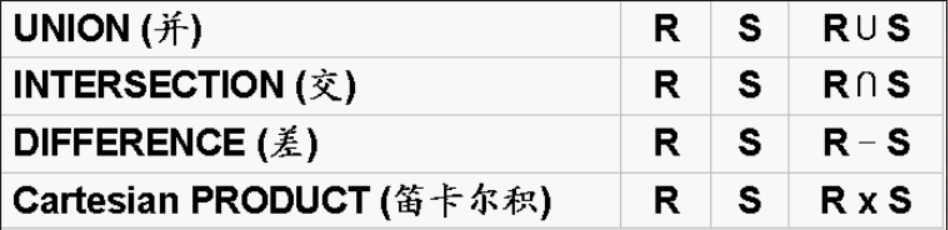
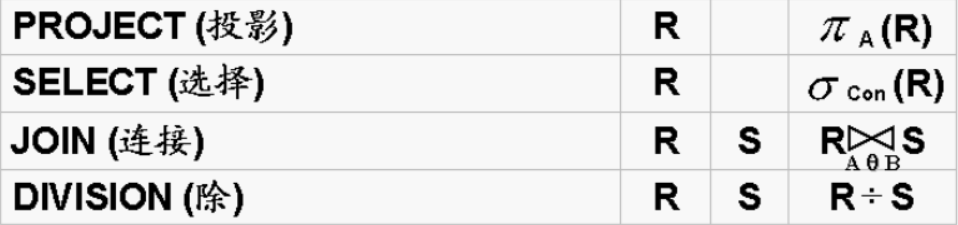

# 基本概念
### 域 *Domain* $D_i$
定义 ：**相同数据类型** 的 值的**集合**

   - 每一列属性的**所有可能取值**

**基数**：集合中的**元素个数**$\rightarrow N(D)=N(d_1,d_2,...,d_m)=m$

### 笛卡尔积   $D_1\times D_2\times ..\times D_n$
定义： 一组域$\{ D_i \} , i=(1,2,...,n)$

关系运算中耗时最长的关系运算
则这组域上的笛卡尔积：
$$
D_1\times D_2\times ..\times D_n=\{ (d_1,d_2....,d_n)|d_i \in D_i ,i=1,2,...,n \}
\\
\because 其中元组(d_1,d_2....,d_n)是从每一个D_i中"任意"取的一个值所构成的组合\\
\therefore 笛卡尔积 = n个域形成的"所有可能"的"n-元组集合"
$$
**元组**：**笛卡尔积的**每一个**元素**$(d_1,d_2....,d_n)$

**分量**：**元组**$(d_1,d_2....,d_n)$的每一个**值**$d_i$

**（笛卡尔积的）基数**：
**元组个数**：$m_1 \times m_2 \times....\times m_n\rightarrow其中m_i为域D_i的基数$

### 广义笛卡尔积 R X S
定义：R中的元组域S中的元组进行所有可能的拼接构成 （抽象的）
$$
R\times S = \{<a_1,a_2,....,a_n,b_1,b_2,....,b_m> | <a_1,a_2,....,a_n>\in R \wedge <b_1,b_2,....,b_m>\in S    \}
\\
\begin{align*}\
& 其中R\times S：\\
& (n+m)度关系：degree(R\times S)=degree(R)+degree(S)=n+m\\
& 基数：Tuple(R\times S)=Tuple(R)\times Tuple(S) = x\times y
\end{align*}

$$
应用：
   - 检索涉及多个表—————>将所有表**串接/拼接**
   - **连接运算**的基础
### **关系** R
- **定义**：
   - 一组域$D_1,D_2,....,D_n$的**笛卡尔积**的**子集**
   - 笛卡尔积中<u>具有某一方面意义</u>的**元组集合**$$记为：R(A_1:D1 , A_2:D_2 , .... , A_n:D_n)\\ 简记：R(A_1,A_2,...,A_n)\\其中 : R\rightarrow关系名字 ,A_i\rightarrow属性 , D_i\rightarrow属性对应的域$$
- **种类**：
   - **基本关系**（基本表/基表）:
      - 列同质
      - 不同列 可以来自 同一个域
      - 列の顺序无关
      - 行の顺序无关
      - 任意两个元组の **候选码** 不能取 相同值
      - 分量必须取 **原子值**
   - **查询表**
   - **视图表**

**属性名**：列名 ----> 不同列可能来自**同一个域**！！！

**度/目 （*degree*）**:关系中**域/属性的个数** $\rightarrow degree=N(域) = N(属性) = M$

**基数**：关系中**元组的个数**

### 候选码/候选键 *Candidate Key*
定义：
   - 关系中的一个**属性组**
   - **唯一标识**：其值能唯一标识一个元组
   - **不可缺**：在该属性组中去掉任意一个属性，便不具有该性质 ！

特点：
   - **可组合**：可以两个或以上的属性组共同构成一个候选码(Ai,Aj)
   - **多样性**：可以有多个属性同为候选码（都符合定义要求）
### 主码/主键 *Primary Key* Fk
定义：**候选码中****选定**的一个，$主码 = 候选码_i$

作用：作为 **主要线索** $\rightarrow$ DBMS以主码为<u>主要线索</u>管理关系中的各个元组

### 主属性/非主属性
定义：包含在任何一个候选码中的属性 $\rightarrow 主属性_i \in {候选码_i}$
### 外码/外键 *Foreign Key* Pk
定义：
   - R中的一个**属性组**
   - 不是本关系R的候选码
   - 是**另一个关系S**的候选码相对应 （间谍）
作用：**连接**两个关系

# 关系模型
1. 历史
   
|||
|:----:|:----:|
|提出者|E.F.Codd|
|抽象基础|Table+Table的处理方式|
|理论支撑|**集合理论** + **逻辑学理论**|
|地位|三大经典数据模型之一|
|发展|SQL语言建立于此基础|

2. 与**关系**的关联：
   - **一个 关系模式** 可以$\rightarrow$对应**多个关系**
   - 关系模式$\rightarrow$关系的结构
   - 关系模式在**某一时刻**的数据$\leftarrow$关系
  
   - 关系模型：**固定的**
   - 关系：**某一时刻的值**
  
3. **基本组成**：
   - **数据结构** ：描述“**DB各种数据**”的基本结构形式
   - **关系运算** ：描述“**Table与Table之间**”所可能发生的各种操作
   - **完整性约束** ：描述**操作**所应遵循的约束条件
  
4. **三大要素** ：
   
**基本结构**
   - Relation/Table

**基本操作**
   - 并 ∪
   - 差 - 
   - 广义积 X
   - 选择 $\sigma$
   - 投影 Π
   - 交 ∩
   - 连接 
   - 除 ÷

**完整性约束**：
   - **实体完整性** ： DBMS提供
   - **参照完整性** ： DBMS提供
   - **用户自定义完整性**

### 实体完整性
定义：
   - **主码**(候选码)的属性值不能为空值

**空值**：
   - 未知值
   - 不存在的值
   - 没有意义的值

### 参照完整性
定义：假设关系R1的**外码Fk**与关系R2中的**主码Pk** , 则：
   - 每一个Fk = R2中某个元组的Pk
   - 或   Fk = **空值**
要求：外码Fk的参照关系R2必须存在
### 用户自定义完整性
定义：用户正对**具体的应用环境**定义的完整性约束条件

4. **关系运算** 
   |**关系运算**|对象|对应操作语言|
   |:----:|:----:|:----:|
   |**关系代数**|基于 **集合** 的运算|*ISBL* ：用计算机可识别的 **符号**表征关系代数的运算符号|
   |**关系演算**|基于 **元组/域** 的演算|*QUEL* :用计算机可识别的 **符号**表征元组演算的运算符号|
**实现对象**：DBMS !!!!!!

4. **关系特性** 
   - **列同质**：每一列的分量来自**同一个域** + 是**同一类型**的数据
   - **列位置互换性**：区分列靠列名，而不是第几列
   - **行位置互换性**：区分行是靠某一/几列的值（Primary/Foreign/Candidate Key）
   - **互异性**：**关系**的任意两个元组不能**完全相同**(Table可能并不完全遵循)
   - **属性不可再分性**：关系的**第一范式**
   - $A_i$:**必须不同**
   - $D_i$：可以相同

# 关系代数 ----关系运算
1. 定义：
   - 基于集合
   - 提供一系列的 **基本操作** + **拓展操作**
   - 输入 ： 一个/多个**关系**
   - 输出 ： **新的关系**
2. **特点**：
   - **过程性** ：对关系的运算来表达查询，需要**指明所用操作**
   - **抽象性** ：是一种抽象的语言，学习其他数据库语言（SQL...）的基础

3. **基本操作**：

基本运算：并，差，选择，投影，乘积

   **集合操作** 

### 并 *Union*  U
定义：（**或者**）
$$
R \cup S = \{ t | t \in R \vee t \in S\}
$$
操作：
   - **合并**R S
   - **去重**
### 差 *Difference*  - 
定义：（**存异**）
$$
R - S = \{ t | t \in R \wedge t \notin S\}
$$
特点：
   - **非对称性** ：$R-S \not ={S-R}$
### 交 *Intersection* ∩
定义：（**求同**）
$$
R \cap S = \{ t | t \in R \wedge  t \in S\}\\
其中：R \cap S = R-(R-S) \not ={R}\\
      P \cap S =S-(S-R) \not ={S}
$$

   **纯关系操作** 

### 选择 *Select*  $\sigma$ 
定义：**关系R** + **给定选择条件*condition***
$$
\sigma(R) = \{ t | t \in R \wedge con(t)='真'\}
\\ 选出“行”组成新的关系
$$
### 投影 *Project*  $\prod$ 
定义：**关系R** + **关系属性A**
$$
\prod _~A_~i1~,A_~i2~,...,A_~ik~~ (R)=\{ <t[A_~i1~],....,t[A_~ik~]> |t\in R\}\\
挑选“列”组成新的关系，去掉重复的元组\\
\begin{align*}
& 其中：\\
& R = R(A_1,A_2,...A_n)\\
& \{A_~i1~,A_~i2~,...,A_~ik~\}\subseteq \{A_1,A_2,...A_n\}
& t[A_i]：元组t中相应于属性i的分量（第t行的A_i列）
\end{align*}
$$
### θ连接 *theta-Join*  $\theta$ 
**定义**：涉及多表之间的连接（$\theta 连接\not ={连接}$）
$$
给定关系R，S，对应属性A，B，对应关系元组t[Ai],s[Bi]：\\ 
\underset{A\theta B}(R \bowtie S)=\sigma_~t[A]\theta s[B]~(r\times S)\\
$$
**操作**：
   - Step 1 **广义笛卡尔**：对R,S进行**广义笛卡尔积**
   - Step 2 **选择**：从广义笛卡尔积中**选取出符合条件**的元组
   - Step 3 **投影**：在筛选的元组中进行投影操作，得到最终的结果
**注意**：θ只为一个广义运算符，可以代表许多的运算操作

### 等值连接 *Equi-Join*  $A=B$ 
**定义**：涉及多表之间的连接（$等值连接\not ={连接}$）
$$
给定关系R，S，对应属性A，B，对应关系元组t[Ai],s[Bi]：\\ 
\underset{A=B}(R \bowtie S)=\sigma_~t[A]=s[B]~(r\times S)\\
$$
**注意**：
   - **特殊的θ连接**：当θ运算符为"="时，θ连接——>等值连接
   - 操作同θ连接

### 自然连接 *Natural-Join* 
**定义**：涉及多表之间的连接（$自然连接\not ={连接}$）
$$
\begin{align*}
& 给定关系R，S，对应属性组A，B，对应关系元组t[Ai],s[Bi]：\\ 
& 选取R,S中相同属性组B_i=A_i上值相等的元组构成:
\end{align*}
\\
R \bowtie S=\sigma_~t[B]=s[B]~(r\times S)\\
$$
**注意**：
   - **特殊的等值连接**：当A=B时，等值连接 ——> 自然连接
   - **R，S有相同的属性组Bi**:Natural操作于这个共同的属性组
   - **无重复**：结果需要去掉重复的**属性列**

**操作**：
   - Step 1 **广义笛卡尔**：对R,S进行**广义笛卡尔积**
   - Step 2 **等值选择**：从广义笛卡尔积中**选取出相同列上值相同**的元组
   - Step 3：**去重**：去掉重复的列
   - Step 4 **投影**：在筛选的元组中进行投影操作，得到最终的结果

### 外连接 *Outer-Join* 
应用：连接R与S存在**失配元组**

**失配元组** ：无相匹配的元组（信息丢失/空值/...）————> 全为空值的元组

定义：
$$ 
外连接 = 自然连接/θ连接 + 失配元组\\
 -------------------------------------\\
 左外连接 = ... + 左侧表中的失配元组\\
 右外连接 = ... + 右侧表中的失配元组\\
 全连接   = ... + 两侧表中的失配元组\\
 -------------------------------------\\
$$

### 除 *Division* $\div$
应用：求解“查询...**全部的/所有的**...问题”

**前提条件**：
$$
\begin{align*}
& 关系R(A_1,A_2,....,A_n) :n度关系\\
& 关系S(B_1,B_2,....,B_m) :m度关系\\    
\end{align*}\\
条件：B为A的真子集\rightarrow \{B_1,B_2,....,B_m\}\subset \{A_1,A_2,....,A_n\} \rightarrow m<n
$$
定义：
$$
R \div S = \{t|t\in \prod_{R-S}(R)\wedge \forall u\in R(tu \in R) = \prod_{R-S}(R)-\prod((\prod_{R-S}(R))-R)  \}\\
(n-m)度关系:\\
属性集 C=\{C_1,C_2,...,C_k\} = \{A_1,A_2,....,A_n\} - \{B_1,B_2,....,B_m\}\\
元组：R\div S的元组<c_1,c_2,...,c_k>与S中每一个元组<b_1,b_2,....,b_m>组成的新元组都是R中的某一个元组<a_1,a_2,...,a_n>
$$
**操作**：
   - Step 1 ：挑选R**满足S中全部元组条件**的元组
   - Step 2 ：去重
   - Step 3 ：去除S中的属性组
**意义**：
 **所有完全**满足S条件R中的元组的其他属性

1. **SQL运算结构**：
   
|||
|:----:|:----:|
|**基本动作**|关系模型的基本运算（基本操作）|
|**复杂动作**|关系模型基本运算的各种组合|
|**程序执行机构**|DBMS|
|||

1. **运算约束**：

### 相容性
定义：关系R$(A_1,A_2,...,A_n)$ 与 关系S$(B_1,B_2,....,B_m)$ 存在相容性，当且仅当：
   
   (1). $n=m \rightarrow$ R 与 S的属性数目相同 
   
   (2). $Domain(A_i)=Domain(B_i) \rightarrow$对于任意i，关系R的第i个属性的域必须域关系S的第i个属性的域相同