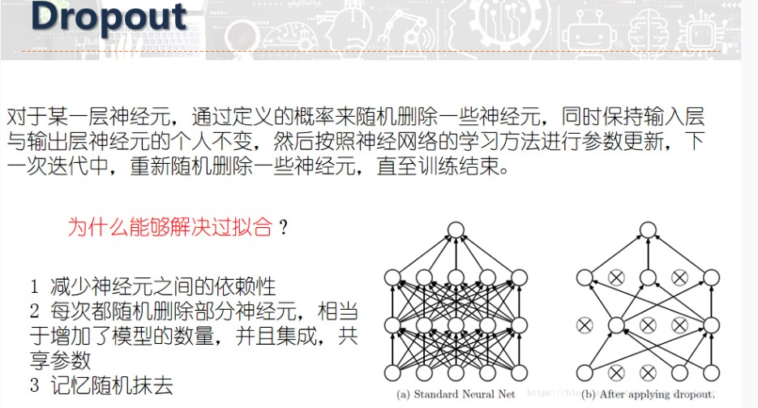
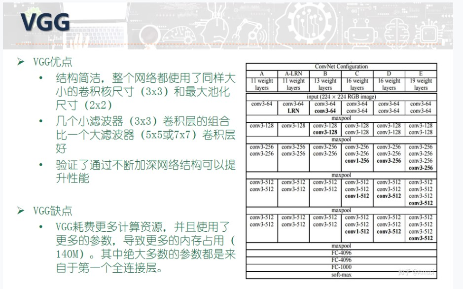

# **基本概念**
### **神经元模型**
   - 简称"简单单元"
   - 神经网络中的 **最基本成分**
### **神经网络**
**定义**：
$$
是\left\{\begin{aligned}
&具有适应性の\\
&简单单元~组成の\\
&广泛~并行互联の\\
\end{aligned}\right.~网络
$$
**作用**：
   - 模拟 **生物神经系统** $\Longrightarrow$ 对 真实世界物体 所做出的反应
### **兴奋**
当神经元兴奋，将会向其他**相连神经元**发送"化学物质"(信息)
   - 0：神经元 **抑制**
   - 1：神经元 **兴奋**
### **阈值**
使神经元兴奋的**最小**"电位"(下限值)

### **MP神经元**   **阈值逻辑单元**
**模型构成**：
   - 输入：来自n个其他神经元传递过来的输入信号 $x_i$
   - 连接：n个输入信号通过n个各自对应的权重 $w_i$ 进行连接传递
   - 输出：$y=f(~\underset{i=1}{\stackrel{n}{\sum}}~w_i x_i - \theta~)$ + **激活函数**处理

### **隐藏层**  *hidden layer*
**定义**：位于输入层与输出层之间的一层神经元

### **线性可分**
若两类模型线性可分----> 则**一定存在**一个**线性超平面** 可以将它们完全分开
### **激活函数**
- **阶跃函数**：
   - 优点：
      - **理想** の激活函数$\left\{\begin{aligned}~0~~:抑制神经元\\~1: ~~激活神经元\end{aligned}\right.$
   - 缺点：
      - 不连续
      - 不光滑
- **Sigmoid**函数：
   - 优点 ：
      - 连续
      - 光滑
      - 常用の
# **感知机** *Perceptron*
- **模型构成**：：
   - 两层神经元
   - 输入层：接受外部信号
   - 输出层：M-P神经元

-  **应用**：：实现基本**逻辑运算**
   - **与**$x_1\wedge x_2$：$$令 w_1=w_2=1,\theta=2\\ y = f(1·x_1+1·x_2-2)$$
   - **或**$x_1\vee x_2$：$$令 w_1=w_2=1,\theta=0.5\\ y = f(1·x_1+1·x_2-0.5)$$
   - **非**$\urcorner x_1$：$$令 w_1=-0.6,w_2=0,\theta=-0.5\\ y = f(-0.6·x_1+0·x_2+0.5)$$
-  **参数处理** ：

**梯度下降法**
迭代更新参数：
$$
w_i\leftarrow w_i +\bigtriangleup w_i\\
\\
\bigtriangleup w_i\leftarrow\eta(y-\tilde{y})x_i\\
$$
其中：$\eta = 学习率 （超参数）$

-  **应用**：：处理**线性可分**的问题
-  **局限** ：只含有一层 **功能神经元**，无法处理 **非线性可分** 的问题$$\Downarrow$$
   - 单个感知机 无法实现 **异或** 逻辑运算  $\Longrightarrow$ 通常使用2个感知机$$\Downarrow$$
- **原理**：
   - 模型 **线性可分**$\longrightarrow$ 感知机の 学习过程一定 **收敛**
   - 模型 **非线性可分**$\longrightarrow$ ...   学习过程 **振荡**$$\Downarrow$$
- **解决方案**：**多层感知机**
   - **特点**：
      - **隐含层**+**输出层** = 具有 激活函数の **功能神经元**
# **多层前馈神经网络***Multi-layer feedforward neural networks*
-  **定义** ：
   - **前馈**：  
      - 输入层 ： 仅接受输入
      - 多层隐藏层 ：对信号进行加工
      - 输出层 ： 输出最终结果
   - **学习**：
      -  训练调整 神经元之间の **连接权** $w_ij$
      -  训练调整 每个 **功能神经元** の**阈值** $\theta_i$
-  **特点**  ：
   - 包含 **多层隐藏层**
   - 每层神经元 与 下一层神经元 **全互连**
   - 不存在**同层连接**
   - 不存在**跨层连接**

-  **学习算法**  ：学习神经元之间连接的 **连接权** 与各个神经元的 **阈值** 
## **误差逆传播算法**  *(标准/累积)BP算法*back-propagation
- 标准BP & 累积BP 的 **区别**：

||标准BP|累积BP|
|:-----:|:-----:|:-----:|
|参数更新|每次只针对 **单个样例**|读取完全部数据( 整个D )之后才进行更新|
|适用|数据集D很大|训练前期|
|

- **损失函数**：

**基于累计误差最小化**
$$
\begin{align*}
&样例(x_k,y_k)的误差：\\
&\qquad \qquad \qquad E_k = \frac{1}{2}\underset{j=1}{\stackrel{l}{\sum}}~(\tilde{y_j^k}-y_j^k)^2\\
&神经网络整体误差：\\
&\qquad \qquad \qquad E = \frac{1}{m}\underset{k=1}{\stackrel{m}{\sum}}~E_k
\end{align*}
$$

- **参数**：
   - **权值**：|输出层|X|隐藏层| + |隐藏层|X|输出层|
   - **阈值**：|隐藏神经元|+|输出层神经元|

- **学习策略**：
**梯度下降算法**

**定义**：以目标的负梯度方向对参数进行调整

任意**参数更新**方式为：
$$
v\leftarrow v+\triangle v
$$
**隐藏层-输出层** **权重**$w_{hj}$:
$$
\begin{align*}
\triangle w_{hj}&=-\eta\frac{\partial E_k}{\partial w_{hj}}\\
&=\eta~·~(-~\frac{\partial E_k}{\partial \tilde{y_j^k}}~·~\frac{\partial \tilde{y_j^k}}{\partial \beta_j})~(\frac{\partial \beta_j}{\partial w_{hj}})   \\
&= \eta~·~g_j~·~b_h 
\end{align*}
$$
**输入层-隐藏层** **权重**$v_{ih}$:
$$
\begin{align*}
\triangle v_{ih}&=\eta~·~e_h~·~x_i    
\end{align*}
$$
**输出层** **阈值**$\theta_j$:
$$
\begin{align*}
\triangle\theta_j = -\eta~·~g_j
\end{align*}
$$
**隐藏层** **阈值**$\gamma_h$:
$$
\begin{align*}
\triangle \gamma_h~=~-\eta~·~e_h
\end{align*}
$$
**梯度项**:
$$
\begin{align*}
g_i &=-~\frac{\partial E_k}{\partial \tilde{y_j^k}}~·~\frac{\partial \tilde{y_j^k}}{\partial \beta_j}\\
&=-~(\tilde{y_j^k}-y_j^k)f'(\beta_j - \theta_j)\\
&=\tilde{y_j^k}·(1-\tilde{y_j^k})·(y_j^k - \tilde{y_j^k})\\
&\\
e_h &= -~\frac{\partial E_k}{\partial b_h}~·~\frac{\partial b_h}{\partial\alpha_h}\\
&==\underset{j=1}{\stackrel{l}{\sum}}~\frac{\partial E_k}{\partial \beta_j}·\frac{\partial \beta_j}{\partial b_h}~·f'(\alpha_h - \gamma_h)\\
&=\underset{j=1}{\stackrel{l}{\sum}}~w_{hj} g_j~·f'(\alpha_h - \gamma_h)\\
&=b_h(1-b_h)\underset{j=1}{\stackrel{l}{\sum}}w_{hj}g_j
\end{align*}
$$

- **算法流程**：
   - Step 1：**初始化参数**：$$在(0,1)中随机初始化网络中的~所有~连接权和阈值$$
   - Step 2：**迭代更新参数**：$$\begin{align*}&<1. 计算当前 连接权+阈值下的样本输出\tilde{y_k}\\&<2.计算梯度项g_j,e_h\\&<3.根据损失函数\rightarrow更新"权值+阈值"\\&<4.达到停止条件return\\\end{align*}$$
   - Step 3：获得**阈值+权值确定的多层前馈神经网络**

- **设置参数个数**：
“”如何设置隐藏神经元的个数？”  $\Longrightarrow$  **试错法**

# **过拟合**
- “如何缓解BP网络的过拟合？”

**早停**

   - 数据划分为 **训练集**+**验证集**
   - **训练集**：计算梯度，更新参数
   - **验证集**：估计误差
   - **早停条件**：train上误差降低，valid上误差升高

**正则化**
 
   - **正则项**：描述**网络复杂度**的部分：
$$
E = \lambda\frac{1}{m}\underset{k=1}{\stackrel{m}{\sum}}~E_k~+~(1-\lambda)\underset{i}{w_i^2}\qquad,\qquad\lambda\in(0,1)
$$
**Dropout**

- **定义**：
   - 通过定义の **概率** $\longrightarrow$ **随机删除**一些神经元 
   - 保持 输入层与输出层 の个人不变
- **意义**：
   - 减少神经元之间の **依赖性**
   - 随即删除 $\longrightarrow$ 增加 **模型数量**+**集成**+**共享参数**
   - **随机性**：记忆 随机 抹去
  

# **局部极小值**
- 如何跳出 **局部最小** 到达 **全局最小**？

**多组参数初始化**

- 使用多组 不同的参数 初始化多个神经网络
- 从多个结果中选择最小的（也可能都是局部最小）

**模拟退火***simulated annealing*

- 接受 **次优解** ---> 有助于跳出局部最优

**随机梯度下降**

- 计算 **梯度项**时**加入随机项**

**遗传算法***genetic algorithms*

# **深度学习** *Deep Learning*
- **特点**：
   - **很深层**的神经网络
   - **多隐层**神经网络

**卷积神经网络** *CNN*

- **基本组成**：
   - **卷积层**： 包含多个 **特征映射** ，输入信号の加工
   - **采样层**： 输入信号の加工
   - **连接层**： 与输出目标之间の映射
   - **采样层**(汇合层)：基于**局部相关性原理**进行**亚采样**

-----
**其余常见的神经网络**：
# **RBF网络** 径向基函数网络    *Radial Basis Function*
- **定义**：
   - **单隐层** 的**前馈**神经网络
   - 以 **径向基函数**作为**激活函数**
   - 输出 = 隐藏层神经元输出的线性组合

- **训练过程**：
   - 确定神经元中心$c_i$ (**随机采样**/**聚类**/....)
   - BP算法确定网络参数（权值 $w_i$ + 阈值 $\beta_i$）

**无监督逐层训练**

基本思想：
   - **预训练**：上一层隐结点的输出作为下一层隐结点的输入
   - **微调**：预选连全部后在进行微调训练

**高斯径向基函数**
$$
\begin{align*}
&\rho(x,c_i) = e^{\beta_i||x-c_i||^2}\\
&\\
&其中：\\
&\qquad x:样本\\
&\qquad c_i:数据中心    
\end{align*}
$$

**RBF网络**

$$
\varphi(x) = \underset{i=1}{\stackrel{q}{\sum}}~w_i~\rho(x,c_i)
$$
**应用**：CNN（卷积神经网络）
# **卷积神经网络** *CNN*
- **基本思想**：**权共享**
   - 一组神经元**共享**相同的**连接权**
- **优点**：
   - 大幅减少了 需要训练 の **参数数目**
- **组成**：
   - 输入层
   - **卷积层**：特征映射 $\Longrightarrow$ 卷积滤波器进行 **特征提取**$$\begin{align*}&作用：\\&\qquad\qquad特征提取\end{align*}\\ \begin{align*}&特点：\\&\qquad\qquad稀疏交互\\&\qquad\qquad参数共享\\&\qquad\qquad等变表示\\ \end{align*}$$
   - **池化层**---->**采样层**：（汇合层）基于"**局部相关性**"原理进行 亚采样 $\Longrightarrow$ 减少数据量+保留有用信息$$\begin{align*}&作用:\\&\qquad <1>.增大~感受野\\&\qquad <2>.局部平移不变性\\&\qquad <3>.处理不同大小输入\end{align*}$$
   -  **连接层**：（隐藏层）传统神经元连接层 $\Longrightarrow$ 连接完成识别任务
   - **激活层**：对 **卷积层**の输出做一次 **非线性映射**$$\begin{align*}&常用激活函数：\\&\\&\qquad Sigmoid函数~:~\\&\qquad\qquad sigmoid(x)=\frac{1}{1+e^{-x}}\\&\\&\qquad Tanh函数~:~\\&\qquad\qquad Tanh(x)=\frac{sinh(x)}{cosh(x)}=\frac{e^x~-~e^{-x}}{e^x~+~e^{-x}}\\&\\&\qquad ReLU函数~:~\\&\qquad\qquad ReLU(x)=max(0,x)\\&\\&\qquad Softmax函数：~:~\\&\qquad\qquad \sigma(z)_j~=~\frac{e^z~j}{\sum_{k=1}^k~e^zk}\\&\\&\qquad LeakyReLU函数\\&\qquad...\end{align*}$$
   - **全连接层** $$\begin{align*}&内容:\\&\qquad 全连接层中の~每个神经元\longrightarrow 与前一层の所有神经元~进行~"全连接"\\&\\&作用~：\\&\qquad~整合~"卷积层"/"池化层"具有~"类别区分性"の~局部信息\end{align*}$$
   - 输出层

- **激活函数**：**修正的线性函数**
$$
f(x)~=~max(0,x)
$$
# **ART网络**自适应谐振理论   *Adaptive Resonance Theory*
   - **无监督** 学习
   - **胜者通吃** 原则：**每一时刻**仅有**一个**竞争胜利的神经元被**激活**，其他神经元状态被抑制
   - **竞争型**学习的重要代表

- **组成**：
    - 比较层：接受输入样本 + 传递给识别层
    - 识别层：每个**神经元**对应一个**模式类**
    - 识别阈值：
    - 重置模块

- **组成**：
   - 可以进行 **增量学习**
   - 可以进行 **在线学习**

**增量学习**

- **批模式**得在线学习

**定义**：学得模型后，在接收到**训练**样例时，仅需**根据新样例**对模型进行**更新**，无需重新训练整个模型

-----> **先前学得**的**有效信息**不会被**冲掉**
    
**在线学习**

   - **增量学习**的特例

**定义**：每获得一个**新的样本**就进行一次**模型更新**
# **SOM网络** 自组织映射   *Self-Organizing Map*
   - **竞争学习**型神经网络
   - **无监督**学习
   - **高位输入**数据映射到 **低维空间**
   - **保持**输入数据在高维空间的**拓扑结构**
   - **输出层**：以 **矩阵**方式排列在二维空间

- **训练目标**：
   - 为每一个 **输出层**神经元找到合适的权向量

- **训练过程**：
   - 寻找**最佳匹配单元**：**训练样本**与 每个**输出层**神经元自身携带的**权向量**得距离**最近**得神经元
   - 调整**权向量**：仅调整最佳匹配单元及其邻近神经元的
   - 不断**迭代**，直到**收敛**
# **级联相关网络** 构造性神经网络 *Cascade-Correlation*
- **主要成分**：
   - **级联**：建立层次连接的 **层级结构**
   - **相关**：**最大**化新神经元的输出与网络误差之间的**相关性**来**更新**相关的**参数**

- **特点**：
   - 无需设置 **网络层数**
   - 无需设置 **隐藏层神经元个数**
   - 训练速度较快
   - 将 **网络结构**当作学习的目标之一
# **Elman网络**常用の递归神经网络
- **特点**：
   - 隐层神经元的**输出**被反馈回来，与下一时刻的**输入层**神经元一起提供**隐层的**下一次**输入**
   - **激活函数**：通常为Sigmoid函数
   - 训练算法：通常为 BP算法

**循环神经网络**

- **特点**：
   - 允许网络中出现 **环状结构**
   - 一些神经元的**输出反馈**回来**作为输入信号**
# **长短期记忆神经网络**  *LSTM*
- **类别**：**时间循环**神经网络
- **应用**：
   - 处理/预测 **时间序列**中 间隔/长延迟 の事件
      - 手写识别
      - 语言识别
      - ...
# **Boltzmann机** *基于能量的模型*
- **特点**：
   - 为 **网络状态**定义一个 **能量**
   - 神经元为**布尔型**，只能取{0,1}**两种状态**
   - 训练时，每一个**样本**视为一个**状态向量**
   - **全连接图**，训练复杂度很高

- **学习目标**：
   **能量最小化** -----> 最小化能量函数
$$
\begin{align*}&E(s) = -\underset{i=1}{\stackrel{n-1}{\sum}}\underset{j=i+1}{\stackrel{n}{\sum}}~w_{ij}~s_i~s_j~-~\underset{i=1}{\stackrel{n}{\sum}}\theta_i~s_i\\&\\&s:状态向量\rightarrow s\in\{0,1\}^n~~~n个神经元的状态\\&w_{ij}神经元i与j之间的连接权\\&\theta_i：i神经元的阈值\\&\\&P(s):s的出现概率\rightarrow由 's的能量'+'所有可能状态向量的能量'  确定：\\&P(s)=\frac{e^{-E(s)}}{\sum_te^{-E(t)}}\end{align*}
$$
- **训练算法**：
  
**对比散度**  *CD**Contrastive Divergence* 

