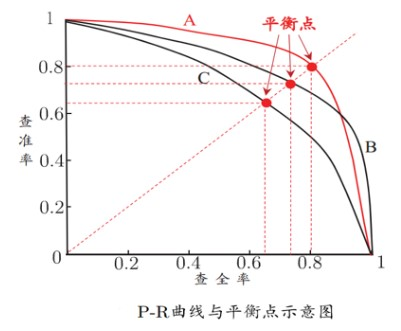
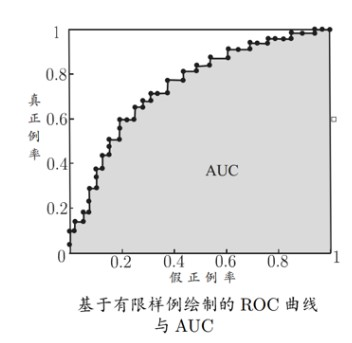
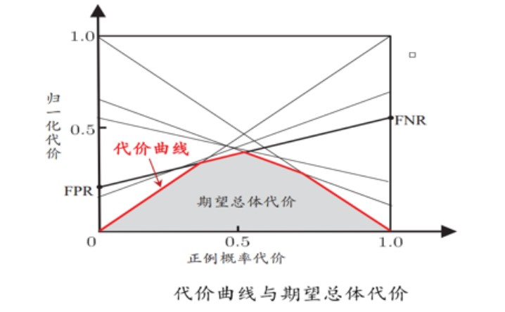

# **基本术语**
### **数据集**
   - 记录的集合
### **样本**/**示例**
   - 一个事例/对象
### **特征向量**
   - 一个示例
### **标记** *Label*
   - 示例结果的信息
### **样例**
   - 拥有了标记信息的示例
### **属性**/**特征**
   - 反映**事件/对象**在某方面的**表现/性质**的事项
### **属性值**
   - 属性上的取值
### **属性空间**/**样本空间**/**输入空间**
   - 属性张成的空间
### **标记空间**/**输出空间**
   - 所有标记的结果
### **假设空间** *hypothesis space*
给定学习算法 $\zeta$ ,它所考虑的所有可能概念的集合，用符号$\mathbf{H}$.
   - H 与 C通常是不同的
   - 学习算法 $\zeta$ 会把自认为可能的目标概念集中起来构成H
   - 学习过程 = $\zeta$在H中进行的搜索过程

### **版本空间**
   - 多个于训练集一致的**假设集合**
### **学习**/**训练**
   - 从数据中学得模型的过程
### **学习器**
   - 在有关数据上学得的**模型**
### **假设**
   - 学习器从有关数据中学得的某种潜在规律
   - 不一定/大部分情况下不为真相
   - 一个逼近于真相的潜在规律
### **真实**/**真相**
   - 潜在规则自身
### **泛化能力**
   - 学的模型适用于新样本的能力
### **损失函数**/**代价函数**
   - 评估 模型の **预测值**与 **真实值**之间不一致程度
----
### **归纳**
   - 科学推理的两大基本手段之一
   - 特殊到一般的**泛化过程**
### **归纳学习**
   - 从样例中学习
### **演绎**
   - 科学推理的两大基本手段之一
   - 一般到特殊的**特化过程**

### **概念** *concept*
   - 从样本空间 X 到标记空间$\mathbf{Y}$的映射
   - 决定示例x的真实标记y

### **概念学习**
   - 狭义归纳学习
   - 从训练数据中学得概念

### **归纳偏好**
   - 算法学习过程中对某种类型假设的偏好
   - 对应了“什么样的模型更好”

# **原理** or **定理**
### **奥卡姆剃刀**原则 *Occam's Razor*
   - 解决 **归纳偏好**的问题

原则：
    若有多个假设与观察一致，则选择**最简单**的那一个； 一般而言，曲线**更平滑**，假设**更简单**
### **没有免费的午餐**定理  *NFL*
- **前提**：
    所有问题同等重要----->所有问题出现的机会相同

- **结论**：
    学习总误差与学习算法无关----> 任意两个学习算法 $\Sigma_a$ 与 $\Sigma_b$期望值相同

**意义**：
    具体问题具体分析，脱离实际等于bullshit

### **概率近似正确** *PAC* (Probably Approximately Correct)
   - 以比较大的把我学得比较好的模型
   - 以较大概率学的**误差**满足**预设上限**模型

PAC辨识

- **定义**：：
学习算法能以较大的概率(≥1-$\delta$)学到目标概念c的近似，误差≤$\epsilon$
$$
\begin{align*}
&对于 0<\epsilon<1,0<\delta<1,所有概念c\in 概念类C\\
&若存在学习算法 \zeta , 其输出假设h\in 假设空间H\\
&满足:\\
&\qquad\qquad\qquad P(E(h)\leq\epsilon)\geq 1-\delta\\
&则称学习算法\zeta能从假设空间H中PAC辨识概念类C   
\end{align*}
$$

**PAC可学习** *PAC Learnable*

- **定义**：
$$
\begin{align*}
&对于 0<\epsilon<1,0<\delta<1,分布D中独立同分布采样得到m个样例数目\\
&对于 所有分布D \\
\\
&若存在~学习算法\zeta ~与~多项式函数poly(·,·,·,·)~\\
&使得对于任何m满足：\\
&\qquad\qquad\qquad m\geq poly(\frac{1}{\epsilon},\frac{1}{\delta},size(x),size(c))\\
\\
&则~学习算法\zeta ~能从~假设空间H~中~PAC辨识~概念类C\\
&则称~概念类C~对~假设空间H~是~PAC可学习~的  
\end{align*}
$$

**PAC学习算法** *PAC Learning Algorithm*

- **定义**：
$$
\begin{align*}
&若~学习算法\zeta~使得概念类C 为 PAC可学习的\\
&且~学习算法\zeta~的~运行时间t = poly(\frac{1}{\epsilon},\frac{1}{\delta},size(x),size(c))\\
&则称：\\
&\qquad 概念类C~是~高效的PAC可学习的\\
&\qquad 学习算法\zeta~为概念类C的PAC学习算法
\end{align*}
$$

**样本复杂度**  *Sample Complexity*

**算法** $\zeta$ 的**时间复杂度** $\stackrel{转化为}{\longrightarrow}$ **样本复杂度**

- **定义**：
$$
\begin{align*}
&假设：\\  
&\qquad 学习算法\zeta 处理每个样本的时间为常数\\
&则：\\
&\qquad学习算法\zeta的时间复杂度~等价于~样本复杂度\\
\\
&学习算法的样本复杂度：\\
&SampleComplexity(\zeta)= \underset{m}{min}\{m\geq poly(\frac{1}{\epsilon},\frac{1}{\delta},size(x),size(c))\}
\end{align*}

$$
# **模型评估**
### **错误率**
   - 错分样本 の **占比**
$$
E~=~\frac{a}{m}
$$
### **误差**
   - **学习器**の **实际预测输出** 与 **样本**の**真实输出**之间の **差异**
### **训练误差**/**经验误差**
   - 学习器在 **训练集** 上的误差

- **公式**：
$$
\widehat{E}(h;D) = \frac{1}{m}~\underset{i=1}{\stackrel{m}{\sum}}~\mathbb{I}~((h(x_i))\neq y_i)
$$
### **测试误差**
   - 学习器在 **测试集** 上的误差
### **泛化误差**
   - 学习器在 **除了训练集**以外の **所有样本** 上の 误差
$$
E(h;D) = P_{x\sim D}(h(x)\neq y)
$$
### **过拟合**
- **定义**：
   - 学习能力过于强大
   - 经训练样本包含的特殊的特性学习到了
- **解决方法**：
   - **正则化**：优化目标加正则项
   - **早停**：减小最大迭代次数
### **欠拟合**
- **定义**：
   - 学习能力低下
   - 对 训练样本の **一般性质** 尚未学好
- **解决方法**：
   - 
---
**评估方法**：

- **评估方面**：
   - **泛化性能**
   - **时间开销**
   - **存储开销**
   - **可解释性**
   - ....
### **最小二乘法** *LSM*   *Least Square Method*
- **二乘法公式**：
$$
\mathcal{Loss(f(x),y)}~=~\frac{1}{2}~\underset{i=1}{\stackrel{m}{\sum}}(f(x_i)-y_i)^2
$$
- **求解参数**：
$$
\begin{align*}
(~w^*,b^*)~&=~\underset{w,b}{argmin}\underset{i=1}{\stackrel{m}{\sum}}(f(x_i)-y_i)^2  \\
&=~\underset{w,b}{argmin}~\underset{i=1}{\stackrel{m}{\sum}}(y_i-wx_i-b)^2
\end{align*}

$$
### **极大似然估计** *MLE*   *Maximum Likelihood Estimation*
$$
\begin{align*}
&假设：\\
&\qquad\qquad D:数据集 D=\{x_1,x_2,...,x_m\}~~\Longrightarrow~~~其中x_i为样本X_iの观测值\\
&\qquad\qquad f(x~|~\theta):样本x~の~概率密度函数~~\Longrightarrow~~~样本x于参数\theta下の似然概率\\
&\qquad\qquad y:真实标签~~\Longrightarrow~~~样本の实际结果
\end{align*}
$$
- **似然函数**：
$$
\begin{align*}
L(\theta)~&=~L(x_1,x_2,...,x_m~|~\theta)\\
&=~\underset{i=1}{\stackrel{m}{\prod}}~f(x_i~|~\theta)
\end{align*}
$$
- **参数求解**：
最优解 = 参数の极大似然估计值
$$
\theta^*~=~\underset{\Theta}{max}L(x_1,x_2,...,x_m~|~\theta^*)\\
$$
### **交叉熵** *CP*   *Cross Entropy*
$$
\begin{align*}
&假设：\\
&\qquad\quad X~:~随机变量\\
&\qquad\quad P(·)~:~概率质量函数\\
&\qquad\quad E[·]~:~期望函数
\end{align*}
$$
- **自信息** *I(·)*：
   - **定义**：
$$
I(X)~=~-log_2P(x)
$$
- **信息熵** *H(·)*：
   - **定义**：系统 **混乱程度** の 度量
$$
\begin{align*}
H(x)~&=~E[I(x)]\\
&\\
&=~E[~-ln(P(x))]\\
\end{align*}\\
\Updownarrow
$$
**离散**随机变量
$$
\begin{align*}
H(x)~&=~\underset{i}{\sum}P(x_i)~I(x_i)\\
&=~-~\underset{i}{\sum}P(x_i)~log_2P(x_i)
\end{align*}
$$
**连续**随机变量
$$
\begin{align*}
H(x)~&=~\displaystyle\int_{-\infty}^{+\infty}~P(x_i)~I(x_i)~dx\\
&=~-~\displaystyle\int_{-\infty}^{+\infty}P(x_i)~log_2P(x_i)~dx
\end{align*}
$$
- **相对熵---KL散度**  *$D_{KL}(·||·)$*：
   - **定义**：两个 **几率分布**$p$与$q$ **差别の** 非对称性度量

**离散**随机变量
$$
\begin{align*}
D_{KL}(P||Q)~&=~-\underset{i}{\sum}~p(i)~ln\frac{q(i)}{p(i)}\\
&\\
&=~\underset{i}{\sum}~p(i)~ln\frac{p(i)}{q(i)}
\end{align*}
$$
**连续**随机变量
$$
\begin{align*}
D_{KL}(P||Q)~&=~\displaystyle\int_{-\infty}^{+\infty}~p(x)~ln\frac{p(x)}{q(x)}~dx\\
&\\
&=~\displaystyle\int_{-\infty}^{+\infty}~ln\frac{p(x)}{q(x)}~dP
\end{align*}

$$
- **交叉熵** H(·,·)：
   - **定义**：基于**相同事件** 测度の 两个概率分布$p$与$q$ 的交叉熵$$\Updownarrow$$
对于一个 "非自然"の概率分布$q$ (相对于 **真实分布**$q$) 进行 **编码**时，在时间集合中 **唯一标识一个事件**所需要の **平均比特数**(bit)
$$
\begin{align*}
H(p,q)~&=~E_p[~-log~q~]  \\
&\\
&=~-\underset{x}{\sum}~p(x)~logq(x)\\
&\\
&=~H(p)~+~D_{KL}(p||q)
\end{align*}

$$

**数据划分**：

### **留出法** *hold-out*
- **定义**：
$$
\begin{align*}
&将数据集\mathbin{D}划分为两个互斥的集合：\\
&其中一个集合作为训练集S，另一个作为测试集T,即：\\
&\qquad\qquad\qquad D = S\cup T \And  S\cap T=\phi    
\end{align*}
$$

- **注意**：
   - 训练/测试集的划分尽可能保持数据**分布的一致性**$\Longrightarrow$**分层采样**$$\begin{align*}&分层采样：\\&\qquad\qquad 保留类别比例の采样方式\end{align*}$$
   - 一般而言以2/3或者4/5的样例作为训练集
   - 一般与操作 **若干次随即划分**+**重复进行实验评估**$$留出法の评估结果~=~(若干次随即划分D~+~重复进行实验评估~)の实验结果の~平均值~$$
### **k折-交叉验证法** *k-cross validation*
**定义**：
$$
\begin{align*}
&将数据集D划分为k个大小相似的 互斥子集：\\
&\qquad\qquad D = D_1 \cup D_2 \cup ...\cup D_k\\
&\qquad\qquad D_i \cap D_j = \phi ~~~(i\neq j)\\
&数据集划分如下：\\
&\left\{\begin{align*}
&\qquad\qquad 测试集 T=D_k~~k\in[1,k]\\
&\qquad\qquad 训练集 S= 剩下的k-1个D_i ~~ ,i\neq k \\ 
\end{align*}\right.\Longrightarrow~~各结果取 均值

\end{align*}
$$
- **结果**：
   - 结果的 **稳定性**与 **保真性** 很大程度取决于k的取值
   - 每个子集$D_i$ 应尽可能保持**数据分布一致性**
   - k_crossValidation 一般需要随机划分p次 ----->** p次k折交叉验证**

- **特例**：**留一法** *LOO*
$$
令 k = m  \longrightarrow 每一个样本X作为一个D_i
$$
- **特点**：
   - 不受随机样本分布的影响
   - 训练m个模型计算开销较大
   - 适用于**样本数量小**的数据集
### **自助法** *bootstrapping*
- **基础**：**自主采样法**
- **定义**：
$$
\begin{align*}
&对于给定的~m个~数据的~数据集D~，对其进行如下采样产生数据集D' ：\\
&\qquad\qquad Step 1. 每次从D中随机挑选一个样本X，将其拷贝至D'\\
&\qquad\qquad Step 2. 将该样本X~放回~初始数据集D（使得X下次还可能被采到）\\
&\qquad\qquad Step 3. 过程重复m次，得到D'    \\
&最后：\\
&\qquad将D'作为训练集\longrightarrow S = D' \\
&\qquad D/D'作为测试集\longrightarrow T = D/D'
\end{align*}
$$
- **注意**：
   - 适用于 **训练集较小** + **难以有效划分**训练/测试集时很有用
   - 可从**单个**数据集D产生**多个不同**的训练集$D'_i$，有益于**集成学习**等

---
**性能度量**：衡量模型的泛化能力

**回归任务**：
### **均方误差** *E(f;D)*
$$
E(\mathbf{f};D) = \frac{1}{m}\underset{i=1}{\stackrel{m}{\sum}}(\mathbf{f}(x_i) - y_i)^2
$$

**分类任务**：
### **错误率** *E(f;D)* --分类任务的常用性能度量
$$
E(\mathbf{f};D) = \frac{1}{m}\underset{i=1}{\stackrel{m}{\sum}}~\mathbb{I}~(f(x_i)~\neq y_i)
$$
### **精度** *acc(f;D)* --分类任务的常用性能度量
$$
\begin{align*}
acc(\mathbf{f};D)& = \frac{1}{m}\underset{i=1}{\stackrel{m}{\sum}}~\mathbb{I}~(f(x_i)~\neq y_i)\\
&=~1 - E(f;D)    
\end{align*}
$$
**信息检索/Web搜索...场景**：
   - 需要测量正例被预测出来的比率
   - 需要预测出来的正例中正确的比率

符号定义：
   - *TP*  : 真正例   √
   - *FP*  ：假正例
   - *FN*  ：假反例
   - *TN*  ：真反例   √
### **查准率**  *P*  (Precision)
$$
P  = \frac{TP}{TP~+~FP}
$$
### **查全率**  *R*  (Recall)
$$
 R=\frac{TP}{TP~+~FN}
$$
### **混淆矩阵** 
|真实情况||预测结果|
|:----:|:----:|:----:|
||正例|反例|
|正例|TP|FN|
|反例|FP|TN|
### **P-R曲线** 
**定义**：将查全率R作为横坐标，查准率P做为纵坐标绘制的曲线

**平衡点** *BEP* (Break-Even Point)：  P = R
**作用**：度量有交叉的各个分类器之间的性能高低

### **F1度量** 
比P-R曲线**更加常用**
$$
\begin{align*}
F_1 &= \frac{2 \times P \times R}{P + R}  \\
&=\frac{2 \times TP}{样例总数 + TP - TN}  
\end{align*}

$$
### **Fβ度量** 
比F1度量**更加常用**
$$
F_\beta = \frac{(1 + \beta^2) \times P \times R}{(\beta^2 \times P) + R}
$$
**注意**：
   - β = 1 ：标准F1
   - β > 1:偏向 **查全率R**  （**信息系统）
   - β < 1 :偏向 **查准率P**  （**推荐系统）

### **ROC曲线** 
给定m+个正例与m-个反例：

**绘制方式**：给定标记点坐标(x,y)
   - 为 **真正例**：$(x,y+\frac{1}{m^+})$
   - 为 **假正例**：$(x+\frac{1}{m^-},y)$
   - 用**线段连接**相邻点
   - **假正例率**为横坐标
   - **真正例率**为纵坐标

**AUC**： ROC曲线下的面积大小

   - **估算**AUC： $AUC = \frac{1}{2} \underset{i=1}{\stackrel{m-1}{\sum}}(x_{i+1} - x_i)·(y_i+y_{i+1})$
   - AUC衡量了样本预测的**排序质量**

### **代价敏感错误率** 

**非均等代价**： **不同类型**的错误所造成的后果可能不同

计算：**最小化总体代价**：
$$
E(f;D;cost) = \frac{1}{m}(\underset{x_i\in D^+}{\sum}~\mathbb{I}(f(x_i)\neq y_i)\times cost_{01}~+~\underset{x_i\in D^-}{\sum}~\mathbb{I}(f(x_i)\neq y_i)\times cost_{10})
$$

### **代价曲线** 
在 **非均等代价**下，ROC曲线不能直接翻译学习器的期望与总体代价

**横轴**：取值为[0,1]的**正例概率代价** $P_{(+)cost}$
$$
P_{(+)cost} = \frac{p\times cost_{01}}{p\times cost_{01} + (1-p)\times cost_{10}}
$$
**纵轴**：取值为[0,1]的归一化代价
$$
cost_{norm} = \frac{FNR\times p\times cost{01} + FPR\times(1-p)\times cost_{10}}{p\times cost_{01}+(1-p)\times cost_{10}}
$$

**估计泛化性能**：**比较检验** 

### **假设检验** 

### **交叉验证t检验** 

### **McNemar检验** 

### **Friedman检验** & **Nemenyi检验** 

**解释泛化性能**：**偏差**+**方差** 

### **噪声** 

### **方差** 

# **模型选择**
**概念定义**：
   - 选用哪一个学习算法
   - 使用哪一种参数配置
---
### **数据集**

