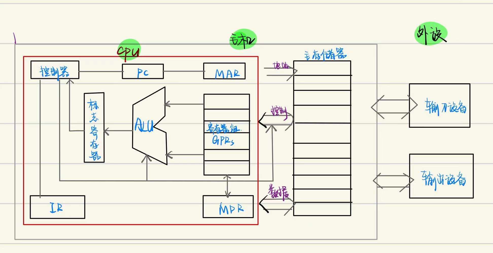

# **发展历史**
### 1.**计算机**

|               类型                |          成果          |
| :-------------------------------: | :--------------------: |
|         **电子管**计算机          | **数据处理机**得到应用 |
|         **晶体管**计算机          | **工业控制机**得到应用 |
|    **中小规模**集成电路计算机     |   **小型计算机**出现   |
| **大规模&超大规模**集成电路计算机 |   **微型计算机**出现   |
|    **巨大规模**集成电路计算机     |   **单片计算机**出现   |

**摩尔定律**：集成电路技术的发展速率
### 2.**半导体存储器**
|       |                                |
| :---: | :----------------------------: |
| 时间  |              1970              |
| 人物  |         仙童半导体公司         |
| 成果  | 第一个较大容量的*半导体存储器* |
| 作用  |        取代*磁芯存储器*        |
### 3.**Inter微处理器**
|  芯片型号  |            地位            |
| :--------: | :------------------------: |
| Intel4004  |   第一块**4位**微处理机    |
| Intel8008  |   第一块**8位**微处理机    |
| Intel8080  | 第一个**通用8位**微处理机  |
| Intel8086  | 第一个**通用16位**微处理机 |
| Intel80386 |   第一个**32位**微处理机   |
### 4.编程语言
|          |                                      |
| :------: | :----------------------------------: |
| 手编程序 | **机器语言程序** ， 手工编译二进制码 |
| 汇编语言 |    **符号语言程序**，汇编程序汇编    |
| 高级程序 |      **算法语言**/**高级语言**       |
# **冯诺依曼机**
### 1.**工作原理**
**①存储程序**：运算开始前，程序+数据先存入存储器

**②程序控制**：计算机的运行在控制器的控制下进行（**指令周期**）

*指令*：指令 = 操作码+地址码

*指令周期*：循环进行“取指令”+“执行指令”操作

*指令流*/*数据流*：计算机对二进制数据的识别方法
### 2.**结构特点**----五大功能部件
|          |                        |                 特点                 |
| :------: | :--------------------: | :----------------------------------: |
|  运算器  |      ACC+MQ+X+...      |               累加记数               |
|  控制器  |        CU+IR+PC        |              *核心部分*              |
|  存储器  |  存储体+MAR+MDR+外存   | 组织特点：按字节组织，容量按字节计算 |
| 输入设备 | 鼠标，键盘，摄像头.... |                                      |
| 输出设备 |   显示器，打印机....   |                                      |

# **计算机硬件**
## **存储器**
1. 基本组成：
   
   ①.**主存储器(内存)**：CPU直接访问-------> 外存信息必须调入内存才可被CPU访问
     
      **辅助存储器（外存）**：帮助“主存”记忆更多的信息

   ②.**MAR**（地址寄存器）：存放“访问地址” （*寻址*）
   
   ③.**MDR**（数据寄存器）：暂存读写信息（*存数*）

   ④.**时序逻辑控制器**：产生存储器操作所需要的各种时序信号
2. 存储体： 存储体=Σ（存储单元）= Σ（Σ（存储元件））
   
   **存储单元**：MAR位数

   **存储元件**：每一位0/1

   **存储字**：一串二进制代码串

   **存储字长**：存储字的位数（1位 = 1bit）

3. 高速缓存（Cache）：存于CPU中
   
## **运算器**
1. 基本组成：
   
    ①.**ALU**：算术逻辑单元 *Arithmetic Logical Unit* -----> *核心单元*

    ②.必备寄存器：

    **ACC** : 累加计数器 *Accumulating Counter*,----->存放*操作数*+*运算结果*
                 
    **MQ** ：乘商寄存器 *Multiply Quotient Register*,----->进行乘除运算操作时

    **X** ：操作数寄存器 *Operand Register*,----->存放操作数

    ③.其他通用寄存器：

    **IX** ：变址寄存器

    **BR** ：基址寄存器

    ④.**PSW**：程序状态（标志）寄存器,----->存放“ALU运算的标志信息”+“处理机的状态信息”

2. 功能：
   ①.计算机的“执行部件”

   ②.用于“算术运算”+“逻辑运算”

### **控制器**
1. 基本组成：

    ①.**PC** : 程序计数器 *Program Counter*
    
    ----->存放下一条指令地址（当前欲执行指令）+自动生成下一条指令的地址
 
    ----->可与“主存直通”

    ②.**IR** : 指令寄存器 *Instruct Register* ,----->存放当前指令

    ③.**CU** : 控制单元 *Control Unit* ， 真正的控制单元

    ------>分析指令

    ------>给出控制信号

2. 功能：
   
   ①.计算机的“指挥中心”

   ②.只会各部件的自主协调工作

### **输入设备** 
1. 基本设备：
    鼠标
    摄像头
    键盘
    ...
2. 功能：将“程序/数据”以*机器所能识别与接收*的信息形式输入计算机

### **输出设备**
1. 基本设备
   显示器
   打印机
   ....
2. 功能：将“程序/数据”以*人们所能接受*/*其他系统所要求*的信息形式输出于设备
   
**冯诺依曼机架构**:

 

cpu与主存之间存在一组总线：

   **地址总线**：与MAR直通  ---> 指向 读写被操作单元

   **控制总线**：判断 + 控制 读写信号

   **数据总线**：读操作，数据通过 *数据线* --->*MDR*；写操作，数据通过*MDR*---->*数据线*

### **其他重要概念**
  **CPU**：中央处理机 = 控制器 + 运算器 + 其他硬件
   
中央处理器 = CPU + 存储器 

  **外设**： 外部设备 = 外存 + I/O设备

  **主机** ：主机 = CPU + 外设

# **计算机软件**
## **系统软件**
**“程序” == “软件”**

1. 功能：
   ①.保证计算机系统高校正确运行的**基础软件**

   ②.作为**系统资源**共享给用户

2. 主要构成：
   
   ①.操作系统OS

   ②.数据库管理系统DBMS

   ③.语言处理程序

   ④.分布式系统

   ⑤.网络软件系统

   ⑥.标准库程序

   ⑦.服务性程序

   ....
###  **多级计算机系统**
由复杂的硬件+软件组合而成的整体
| 级别  |              |    程序设计    |
| :---: | :----------: | :------------: |
|  1级  | 微程序设计级 | 直接由硬件执行 |
|  2级  |  一般机器级  |     微程序     |
|  3级  |  操作系统级  |    操作系统    |
|  4级  |  汇编语言级  |    汇编程序    |
|  5级  |  高级语言级  |    编译程序    |

**软件与硬件逻辑等价**：
   ①.原因：大规模集成电路技术的发展 + 软件硬化 
   ②.软件，硬件<u>界限</u>变得模糊
   ③.<u>任何操作</u>可以用软件实现，也可以用硬件实现
   **考虑因素**：价格，速度，可靠性，存储容量，变更周期....
# **计算机语言**
### **机器语言** （二进制语言）
  1. 计算机*唯一*可以*直接识别与执行*的语言
  2. 需要人工记忆每一条指令的编码

###  **汇编语言**
  1. 用“英文/缩写/...”代替机器语言
  2. 必须由**汇编程序**（系统软件）

### **高级语言**  
  1. 机器无法直接理解/执行的语言
  2. 可通过**翻译程序**将其翻译为机器语言

翻译程序：
   1. **汇编器** ： 汇编语言 -----> 机器语言，全文翻译+保存后再执行

   2. **解释器** ： <u>逐行</u>翻译，逐行执行

   3. **编译器** ：源程序 -------> 目的程序

# **计算机性能指标**
1. 
### **吞吐量** *B/s*
 <u>某一时间间隔内</u>能处理的信息量

### **响应时间** *μs/ns..*
 从输入有效到系统产生相应之间的<u>时间度量</u>
    
### **利用率** **%**
在<u>给定时间间隔内</u>，系统被实际使用的时间所占比例
### **处理器字长** *位数*
运算器一次能够完成的<u>二进制数运算的位数</u>

### **主频** *MHz/GHz*
CPU的主时钟频率f
### **时钟周期** *μs/ns...*
CPU的主时钟频率的倒数:$$T = \frac{1}{f}$$
### **总线宽度**
运算器与存储器之间<u>互联的总线的二进制位数</u>
### **存储器容量**
存储器的字节数
### 存储器带宽 **B/s**
<u>单位时间</u>内从存储器中读出的<u>二进制数信息量</u>

---
### **CPU执行时间**  
CPU<u>执行一段程序</u>所<u>占用</u>的CPU时间:

$$
CPU执行时间 = 执行该程序所使用的“CPU周期数”\times CPU时钟周期
$$

###  **CPI** (*Cycles Per Instruction*) 
每指令周期数----->执行一条指令平均所需要的时钟周期数：

$$
CPI = \frac{执行某段程序所使用的周期数}{程序包含的指令数}
$$

### **MIPS** (*Million Instructions Per Second*) 
每秒百万指令数:
$$
MIPS = \frac{指令数}{程序执行时间\times 10^6}
$$

###  **MFLOPS** (*Million Floating Point Operations Per Second*)
$$
MFLOPS = \frac{浮点操作次数}{程序执行时间\times 10^6}
$$

2. **CPU性能公式**
   
|  字母 |  含义   |  意义  |
| :-----: | :------: | :-----: |
|$T_~cpu~$|CPU时间||
|$N_c$|周期数 ||
|t|时钟周期|同f |
|$f$|时钟频率|  反映*计算机实现技术*+*制造工艺*+*计算机组织*的影响|
|CPI| 平均每条指令的周期数 | 反映了*计算机实现技术指令集*的结构(*ISA*)+*计算机组织 (Complier)*的影响 |
|$I_n$|指令数 ||
|n|指令种类||
|$I_i$|i指令在程序中的执行次数||
|$CPI_i$|i指令所需的平均时钟周期数||

 ①.CPI平均每条指令的周期数
 
 $$
 CPI = \frac{N_c}{I_n}
 $$

 ②.时钟周期数Nc:
 
 $$
 N_c = I_n \times CPI = \sum_{i=1}^n (CPI_i \times I_i)
\\其中 I_i :i指令在程序中的执行次数
      \\CPI_i:i指令所需的平均时钟周期数
 $$

 ③.CPU时间：
 
 $$
 T_~cpu~ = N_c \times t = \frac{N_c}{f}
         = I_n \times CPI \times t
 $$

# **计算机层次结构**

$$
计算机~=~\sum~（硬件~+~软件)
$$

- **分层标准**：
   - **无**统一标准
- **分层依据**の角度：
   - 软/硬件 **设计者** 角度
   - **使用者** 角度
   - 不同 **语言**
   - ...
- **层次结构**：

|层次级别|名称|功能|地位|
|:----:|:-----:|:----:|:----:|
|第$\mathbf{1}$级|**微程序机器** 层|**机器硬件**  $\underset{\Longrightarrow}{直接执行}$    **微指令**|硬件层|
|第$\mathbf{2}$级|**传统机器语言** 层|**微程序**  $\underset{\Longrightarrow}{解释}$   **机器指令**|机器层|
|第$\mathbf{3}$级|**操作系统** 层|**机器指令**（）+**广义指令**（拓展机器功能）|混合层|
|第$\mathbf{4}$级|**汇编语言** 层|**汇编程序**  $\underset{\Longrightarrow}{提供}$ 用户  $\Longrightarrow$    **符号化语言** |汇编程序层|
|第$\mathbf{5}$级|**高级语言** 层 |**面向用户**  $\Longrightarrow$   方便编写 **应用程序**|高级语言编译程序层|
---
||||
|:----:|:----:|:----:|
|第$\mathbf{6}$级|**应用程序** 层|解决 实际问题+应用问题|处理程序层|
# **计算机工作原理**
### 1. **存储程序**の工作方式
- **存储程序**:
   - 程序 **执行前**：将程序所含的 **指令**+**数据**送入 **主存**
   - 程序 **启动执行**：**自动** 逐条完成 **指令** の **取出**+**执行**任务

$$第一条指令\underset{\longrightarrow}{存入} PC\\ \Downarrow\\----\\根据PC 取指令\\\Updownarrow\\指令译码\\PC\longleftarrow PC~+~"1"\\\Updownarrow\\取操作数 ，执行\\\Updownarrow\\送结果\\----\\(虚线内~周而复始~:~自动取出+执行)$$

### 2. **源文件**$\Longrightarrow$**可执行文件**
- **预处理**阶段:
   - $$filename.h~~ \longrightarrow ~~filename.i$$
   - **预处理器**(*cpp*) 进行处理
   - **处理过程**：cpp对源程序中 以**字符#开头**の **命令** 进行处理

- **编译**阶段:
   - $$filename.i~~ \longrightarrow ~~filename.s$$
   - **编译器** (*ccl*) 进行处理
   - **处理过程**：对 **预处理后**の源程序进行编译$$\Updownarrow\\ 每条语句 都以 **一种文本格式**描述 一条 **低级机器语言指令**$$
- **汇编**阶段:
   - $$filename.s~~ \longrightarrow ~~filename.o$$
   - **汇编器** (*as*) 进行处理
   -  **处理过程**：将 汇编后的文件 翻译为$\longrightarrow$  **机器语言指令**  $\underset{\longrightarrow}{打包}$  **可重定位**の **目标文件**(**二进制文件**)
- **链接**阶段:
   - $$filename.o~~ \longrightarrow ~~filename$$
   - **链接器** (*ld*) 进行处理
   -  **处理过程**：合并 **可重定位文件**+**标准库函数**  $\longrightarrow$  可执行目标文件
### 3. **程序** の执行过程
- 基础:
   - **必须**依靠 **OS** の支持$$用户程序~不能直接访问~"底层硬件"\\\downarrow\\依靠~\"OS内核\"~来完成对~外部设备の操作$$
- 本质:
   - **数据** 在 **CPU**+**主存储器**+**I/O设备** 之间流动の过程
### 4. **指令**の 执行过程
- 本质 : 0/1序列
- 作用 :指示CPU完成的一个 **特定**の **原子操作**
- 流程 :
   - **取** 指令 :根据PC将指令取出并送至IR$$(PC)~\longrightarrow~MAR\longrightarrow~M~\longrightarrow~MDR~\longrightarrow~IR$$
   - **分析** 指令 :指令 **译码** + 送出 **控制信号**$$~OP(IR)~\longrightarrow~CU$$
   - **执行** 指令 : **取数**操作$$~Ad(IR)~\longrightarrow~MAR~\longrightarrow~M~\longrightarrow~MDR~\longrightarrow~ACC$$
   - 完成一次 **指令执行**操作，执行下一条指令：$$\begin{align*}&下一条指令地址：\\&\qquad\qquad\qquad(~PC~)+1~\longrightarrow~PC\end{align*}$$
# **计算机应用分类**
### 按**原理**分类：
  1. 数字
  2. 模拟
  3. 混合
### 按**用途**分类：
  1. 通用
  2. 专用（嵌入式）
### 按**性能**分类：
  1. 超级
  2. 大型机
  3. 小型机
  4. 工作站
  5. 个人计算机
  6. ....

     