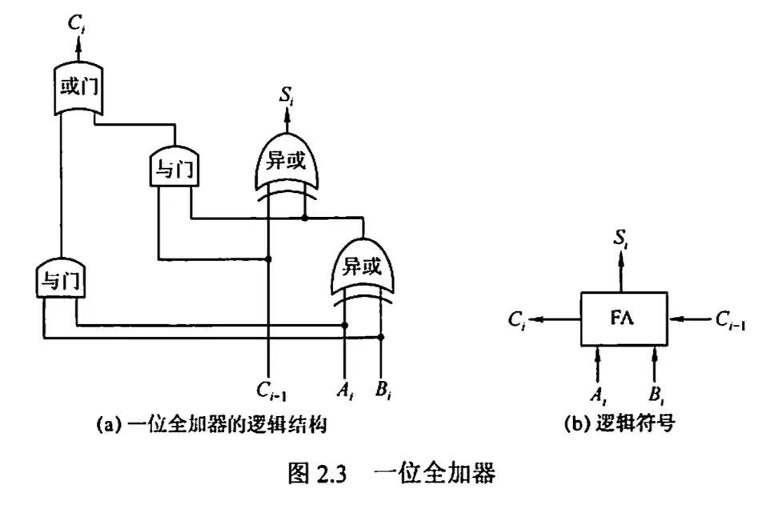
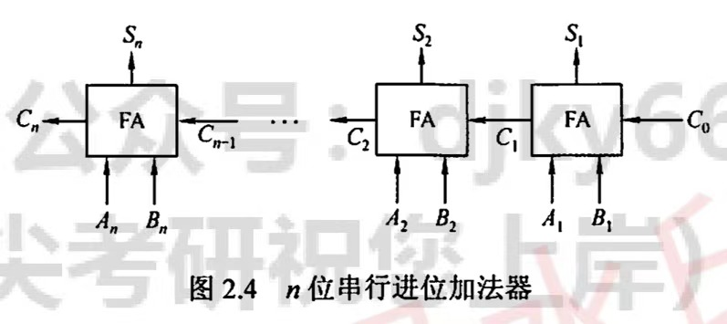
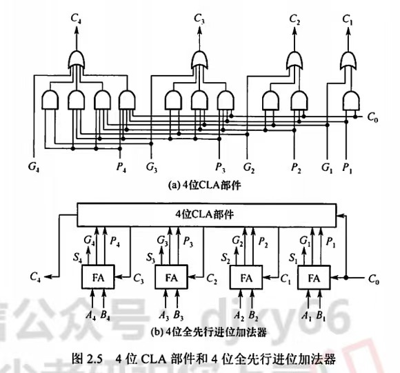
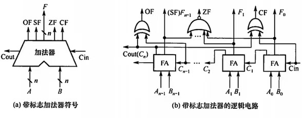
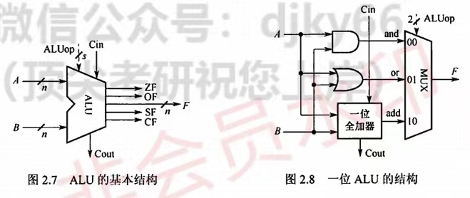

# **基本概念**
### **基数**
**定义**：进位计数法中，每个数位所使用の 不同数码の个数
### **机器码**
**定义**：将符号“数字化”の数

### **真值**
**定义**：机器数所代表の实际值

### **定点小数**
- **定义**：
   - 纯小数
   - 小数点位于~符号位后面$$X~=~0/1~.~x_1x_2···x_n\quad\quad其中0/1表示±符号$$
   - 有效数值部分の **最高位** 为最靠近 **小数点** の$x_1$

### **定点整数**
- **定义**：
   - 纯整数
   - 小数点位于~最后面$$X~=~0/1~x_1x_2···x_n~.\quad\quad其中0/1表示±符号$$
   - 有效数值部分の **最高位** 为最靠近 **符号位** の$x_1$

# **数制**
- **二进制编码の原因**：
   - **低成本**：只有0/1两种状态，使用有两个 **稳定状态**の **物理器件**即可表示
   - **高便利**：计算机实现逻辑运算+逻辑判断便利
   - **易实现**：运算规则+编码规则简单，通过逻辑门电路可以实现算术运算
- **进制转换**：
   - $2~\longrightarrow~8~/~16$:$$8~：~补齐3n位\Rightarrow~每~“三位”~=~一位八进制数\\16~：~补齐4n位\Rightarrow~每~“四位”~=~一位十六进制数\\$$
   - $8~/~16~\longrightarrow~2$:$$8~：~补齐3n位\Rightarrow~每一位~=~转换为~“三位”~二进制数\\16~：~补齐4n位\Rightarrow~每一位~=~转换为~“四位”~二进制数\\$$
   - $任意进制~\longrightarrow~10$:$$\begin{align*}(k_nk_{n-1}...k_0k_{-1}..k{-m})_R~&=\sum_{位数}(权值\times数码)\\&=k_nr^n+k_{n-1}r^{n-1}+....+.k_0r^0+k_{-1}r^{-1}+...+k_{-m}r^{-m}\\&=\underset{i=n}{\stackrel{-m}{\sum}}~k_i~r^i\end{align*}$$
   - $10~\longrightarrow~任意进制$:
      - **整数转换**：**除基取余法**$$先余为低\\\Downarrow\\后余为高\\\Downarrow\\商0结束\\\Downarrow\\下向上读$$
      - **小数转换**：**乘基取整法**$$先整位高\\\Downarrow\\后整为低\\\Downarrow\\积1结束~/~满足精度\\\Downarrow\\上向下读\\ \begin{align*}&\\&\\&\qquad二进制小数\Longrightarrow十进制小数\\&\\&任意~二进制小数~可以用~十进制小数~表示\\&存在十进制小数~不可以~用二进制表示\longrightarrow满足~精度~停止\end{align*}$$

# **编码表示**
### **原码**
- **定义**：
$$
\begin{align*}
&纯小数:\\
&\qquad\qquad\quad[x]_原~=~\left\{\begin{aligned}
&\qquad\qquad x&\qquad\qquad1>x\geq0\\
&1-x=1+|x|~~(符号位+|x|)&\qquad0\geq x>-1
\end{aligned}\right.\\
&\\
&\qquad表示范围：~~x\in~[~-(1-2^{-n}),1-2^{-n}~]\\
&\\
&纯整数:\\
&\qquad\qquad\quad[x]_原~=~\left\{\begin{aligned}
&\qquad\qquad 0~,~x&\qquad\qquad2^n>x\geq0\\
&2^n-x=2^n+|x|~~(符号位+|x|)&\qquad0\geq x>-2^n
\end{aligned}\right.\\
&\\
&\qquad表示范围：~~x\in~[~-(2^n-1),2^n-1~]\\
\end{align*}
$$
- **优点**：
   - 与真值の **对应关系** 简单，直观
   - 与真值 **转换** 简单
   - 实现 **乘除运算** 简便
- **缺点**：
   - **真值0** の **原码表示不唯一** ！！$$[+0]_原~=~0~0000~\neq~[-0]_原~=~1~0000$$
   - **加减**运算 比较复杂
### **反码**
- **真值转换步骤**：
   - **正数**：$$[正数]_反~=~[正数]_{真值}$$
   - **负数**：$$[负数]_反~=~[负数]_{真值}+~"~各位取反~"~\\~[负数]_补~=~[负数]_反+~1~\qquad\qquad\qquad\\\Updownarrow\\~[负数]_{真值}~=~[负数]_反+~"~各位取反~"\\~[负数]_反~=~[负数]_补~-~1\qquad\qquad\quad$$
- **缺点**：
   - **真值0**の **表示不唯一**
### **补码**
- **定义**：**同余**概念
$$
\begin{align*}
&纯小数:\\
&\qquad\qquad\quad[x]_原~=~\left\{\begin{aligned}
&\qquad\qquad x&\qquad\qquad1>x\geq0\\
&2-x=2-|x|&\qquad0\geq x>-1
\end{aligned}\right.~~(mod~~2)\\
&\\
&\quad 规定：~1.000··0~(n个0)~=~-1\\
&\\
&\qquad表示范围：~~x\in~[-1,1-2^{-n}]\longrightarrow比原码多-1\\
&\\
&纯整数:\\
&\qquad\qquad\quad[x]_原~=~\left\{\begin{aligned}
&\qquad\qquad 0~,~x&\qquad\qquad2^n>x\geq0\\
&2^{n+1}-x=2^{n+1}-|x|&\qquad0\geq x>-2^n
\end{aligned}\right.~~~(mod~~2^{n+1})\\
&\\
&\quad 规定：~1.000··0~(n个0)~=~-2^n\\
&\\
&\qquad表示范围：~~x\in~[~-2^n,2^n-1~]\longrightarrow比原码多~-2^n\\
\end{align*}
$$
- **优点**：
   - **加减运算**统一使用 **加法操作**实现
   - 真值0 の **表示唯一**$$[+0]_补~=~[-0]_补~=~0.0000$$
- **真值转换步骤**：
   - **正数**：$$[正数]_补~=~[正数]_{真值}$$
   - **负数**：$$[负数]_补~=~[负数]_{真值}+~"~各位取反，末尾加一~"~\\\Updownarrow\\~[负数]_{真值}~=~[负数]_补+~"~各位取反，末尾加一~"$$ $$方法二：固定符号位不变，右边第一个~1 \longrightarrow\left\{\begin{aligned}1左边~：~取反\\1右边~：~不变\end{aligned}\right.$$
### **移码**
- **定义**：
   - 表示 **浮点数の阶码**
   - 只能表示 **整数**$$\begin{align*}&移码~=~补码符号位取反\\&\\&取值范围：-2^n\leq x\leq 2^n-1\\&\qquad\qquad(与~补码一一对应)\\\end{align*}$$
   - ----
   - $$真值~+~偏置值(常数)\\\Updownarrow\\常取2^n\Longrightarrow向左平移n位$$
- **特点**：
   - **真值0**の **表示唯一**$$[+0]_移~=~2^n+0~=~[-0]_移~=~2^n-0~=~1~00··0~(n个0)$$
   - 便于 **比较大小**$$\begin{align*}&-128~~~~~~\longrightarrow~~~127\\&\\&0000~0000~\longrightarrow 1111~1111\end{align*}$$

# **基本运算部分**
- **运算器の组成**：
   - ALU
   - 移位器
   - 状态寄存器
   - 通用寄存器
   - ...
### **一位全加器**  *FA* *Full Adder*
- **地位**：
   - **最基本**の **加法** 单元
- **组成**：
   - **输入**：
      - 加数 $A_i$
      - 加数 $B_i$
      - 低位进位 $C_{i-1}$
   - **输出**：
      - 本位和 $S_i$
      - 高位进位 $C_i$
- **逻辑表示**：
$$
\begin{align*}
&和表达式：\\
&\qquad\qquad S_i~=~A_i\oplus B_i\oplus C_i-1\\
&\\
&进位表达式：\\
&\qquad\qquad C_i~=~A_iB_i+(A_i\oplus B_i)C_{i-1}
\end{align*}
$$

### **串行进位加法器** （行波进位）
- **组成**：
$$
串行n位加法器~=~\underset{i=1}{\stackrel{n}{\sum}}~(FA)
$$
- **特点**：
   - 每一级の进位都依赖于前一级の进位$\Longrightarrow$**进位信号** 是 **逐级** 形成の
   - 位数有限，高位自动丢失$\Longrightarrow$ 模$2^n$加法运算
   - 低位运算产生进位所需の事件 将 影响高位运算の时间   $~~~\Longrightarrow$ 位数 $\uparrow$，延迟时间 $\uparrow$

### **并行进位加法器** （超前进位）*CLA*
- **逻辑表达式**：
$$
\begin{align*}
C_i~&=~A_iB_i~+~(A_i\oplus B_i)C_{i-1} \\
&=~G_i~+~P_iC_{i-1}  \\
\end{align*}\\
\begin{align*}
&其中：\\
&\qquad G_i:进位产生函数\qquad\qquad G_i=A_iB_i\\
&\qquad P_i:进位传递函数\qquad\qquad P_i=A_i\oplus B_i
\end{align*}
$$
- **特点**：
   - 进位方式快速，与位数无关
   - 位数 $\uparrow~,~C_i$逻辑表达式变长变复杂
- **应用**：
   - **CLA**+串行进位加法器 **组合使用**:
      -  组内串行
      -  组件先行

### **带标志加法器**
- **特点**：
   - 增加相应の逻辑门电路  $\Longrightarrow$  生成相应の **标志信息**$$\begin{align*}&OF~=~C_n\oplus C_{n-1} &\qquad\qquad溢出标志\\&\\&SF~=~F_{n-1}&\qquad\qquad和符号标志\\&\\&ZF=1(F=0)&\qquad\qquad零标志\\&\\&CF~=~C_{out}\oplus C_{in}\left\{\begin{aligned}&C_{in}=0~,~进位C_{out}\\&C_{in}=1~,~C_{out}取反\end{aligned}\right.&\qquad\qquad进位/借位标志\end{align*}$$

### **算术逻辑单元**  *ALU*  *Algorithm Logistic Unit*
- **定义**：
   - 功能较强の **组合逻辑电路**
   - 能进行多种 **算术运算**+**逻辑运算**  $\Longrightarrow$ "带标志加法器"+"逻辑运算"

# **字符の表示**
### **字符---ASCII码** 
- **规定**：
   - 使用 8bit 表示一个字符
   - 最高位 = 0
   - [0,127]个取值$\Longrightarrow$ 128个字符 $$\begin{align*}&[~0,31~]~/~127~:~控制/通信字符~~（不可印刷）\\&\\&[~32,126~]:可印刷字符\left\{\begin{aligned}&大写字母\\&小写字母\\&数字\end{aligned}\right.\Longrightarrow均~连续编码\end{align*}$$
### **汉字** 
- **编码种类**：
   - **区位码** 
   - **国标码** :$$国标码~=~区位码~+~2020H$$
   - **汉字内码** 
   - **输入编码** 
   - **字形码** 
   - **机内码** ：$$机内码~=~国标码~+~8080H$$

### **字符串** 
- **定义**：
   - 从 $低地址\longrightarrow高地址$ 逐个字符存储
   - 常采用 '/0' 作为 **结尾标志**
- **模式**：
   -  **大端模式**：将数据の **最高有效字节**存放在 **低地址单元** 中
   - **小端模式** ：将数据の **最高有效字节**存放在 **高地址单元** 中
# **定点数の运算**
### **移位运算** 
- **算数移位**  
   - **意义**：
      - **左移**：✖基数
      - **右移**：➗基数
   - **添补规则**：

||码制|添补|
|:----:|:----:|:----:|
|正数|原/反/补|0|
|负数|原码|0|
||反码|1|
||补码|左移 补0|
|||右移 补1|

- **逻辑移位** 
**移位规则**：

||丢失位|添补|
|:----:|:----:|:-----:|
|逻辑左移|高位移丢|0|
|逻辑右移|低位移丢|0|
|||
- **循环移位** 
   - **种类**：
      - 带 **进位标志位(CF)** の循环移位 $\Longrightarrow$ 大循环$$移除の位补上空缺$$ 
      - 不带**进位标志位**の循环移位  $\Longrightarrow$ 小循环$$移除の补上CF位\\\Updownarrow\\原CF位不上空缺$$
### **加减运算** 
- **补码**の**加减**运算 

### **乘除运算** 
- **加减运算** 

### **溢出判别**  
- **一位符号位** 

- **双符号位** 

- **一位符号位+数据位** 

# **定点数の表示**

# **浮点数の表示**

# **校验码**
-  **奇偶校验**  
   - **循环冗余校验码** 

-  **奇校验**  

-  **偶校验**  
   - **海明码** 

# **数据存储与排列**